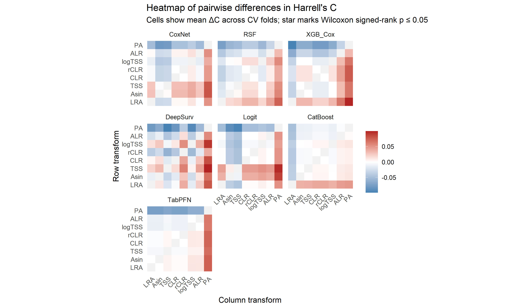
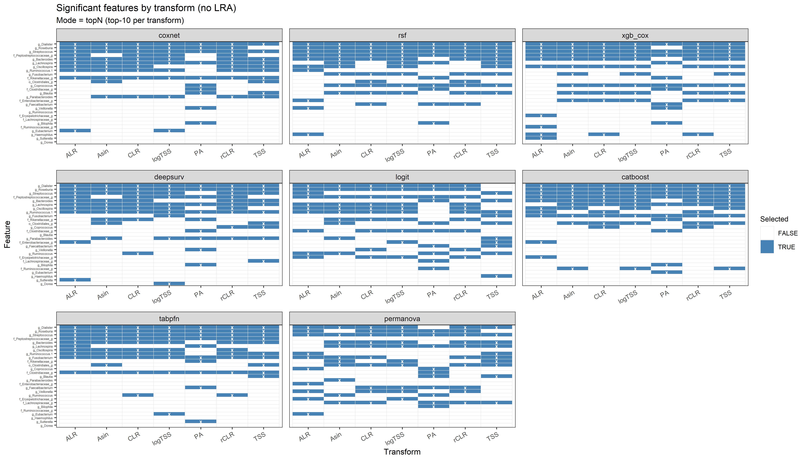
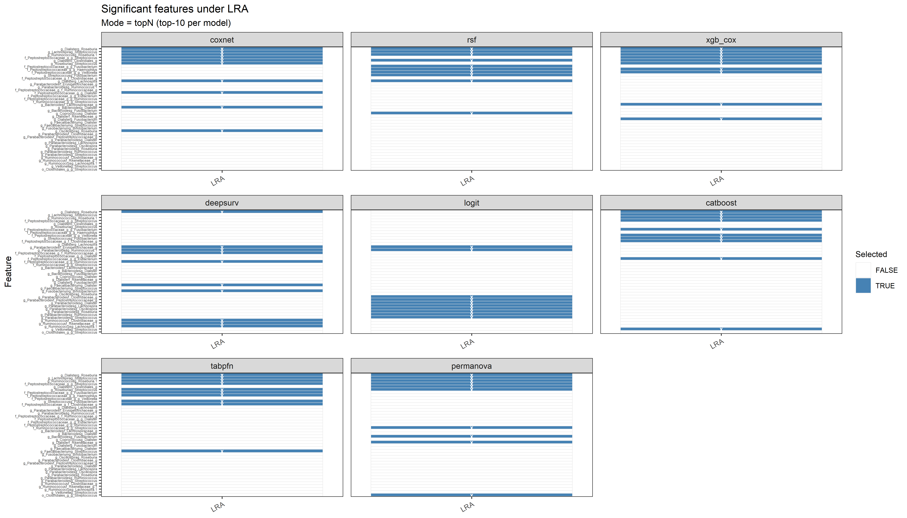
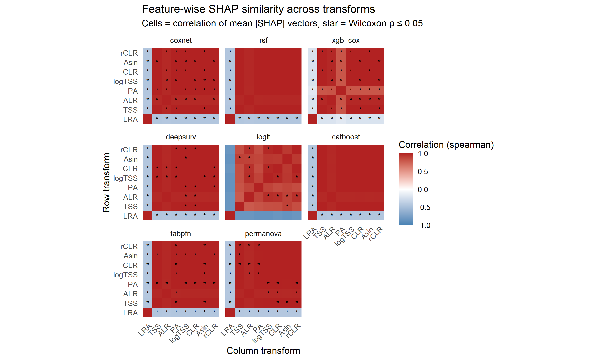
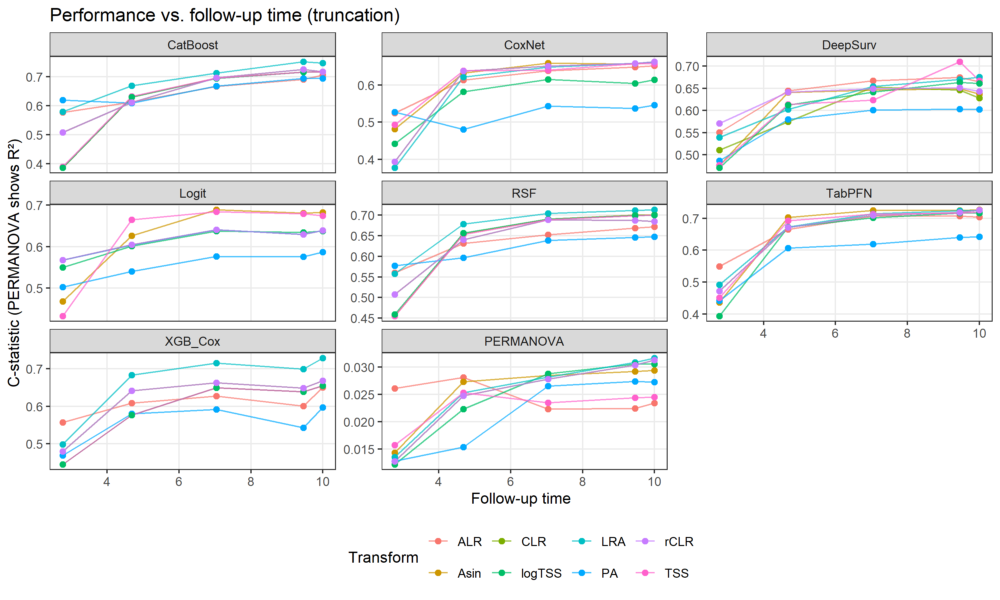
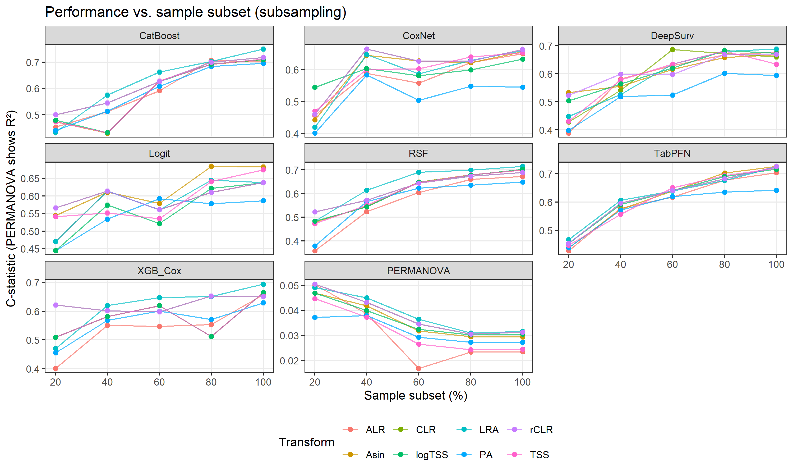
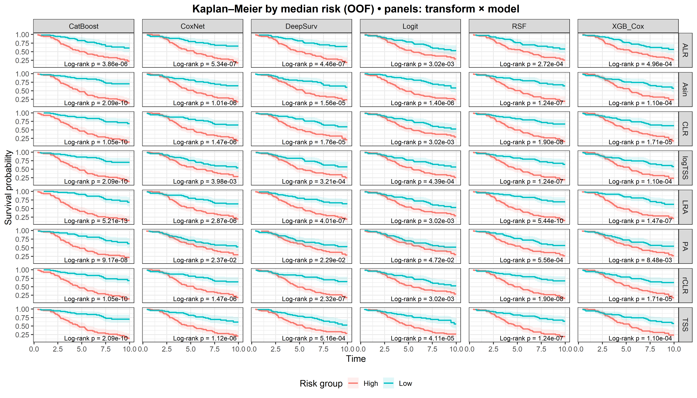

# Survivalanalysis using probabilistic models


Libararies

``` r
# Packages
library(tidyverse)
library(brms)
library(tidybayes)
library(ggplot2)
library(TreeSummarizedExperiment)
library(SingleCellExperiment)
library(posterior)
library(dplyr)
library(tidyr)
library(stringr)
library(survival)
library(survminer)
library(vegan)
library(mia)
library(bayesboot)
library(IDPSurvival)
library(Matrix)
library(patchwork)
library(pROC)
library(RColorBrewer) 
library(cmdstanr)
library(ranger)
library(fastshap)
library(timeROC)
library(xgboost)
library(matrixStats)
library(catboost)
library(reticulate)
library(scales)

# Load funcs
source("Funcs_cleaned.R")
```

Load models and combine

``` r
out_dir <- file.path("model_result", "shap_outputs")

# CoxNet
coxnet_metrics    <- readRDS(file.path(out_dir, "coxnet_metrics.rds"))
coxnet_shap_agg   <- readRDS(file.path(out_dir, "coxnet_shap_agg.rds"))
coxnet_shap_long  <- readRDS(file.path(out_dir, "coxnet_shap_long.rds"))
coxnet_foldC      <- readRDS(file.path(out_dir, "coxnet_foldC.rds"))
coxnet_timings    <- readRDS(file.path(out_dir, "coxnet_timings.rds"))
coxnet_runtime    <- readRDS(file.path(out_dir, "coxnet_runtime.rds"))
coxnet_list       <- readRDS(file.path(out_dir, "coxnet_list.rds"))
coxnet_oof        <- readRDS(file.path(out_dir, "coxnet_oof.rds"))

# RSF
rsf_metrics    <- readRDS(file.path(out_dir, "rsf_metrics.rds"))
rsf_shap_agg   <- readRDS(file.path(out_dir, "rsf_shap_agg.rds"))
rsf_shap_long  <- readRDS(file.path(out_dir, "rsf_shap_long.rds"))
rsf_foldC      <- readRDS(file.path(out_dir, "rsf_foldC.rds"))
rsf_timings    <- readRDS(file.path(out_dir, "rsf_timings.rds"))
rsf_runtime    <- readRDS(file.path(out_dir, "rsf_runtime.rds"))
rsf_list       <- readRDS(file.path(out_dir, "rsf_list.rds"))
rsf_oof        <- readRDS(file.path(out_dir, "rsf_oof.rds"))

# Logistic
logit_metrics   <- readRDS(file.path(out_dir, "logit_metrics.rds"))
logit_shap_agg  <- readRDS(file.path(out_dir, "logit_shap_agg.rds"))
logit_shap_long <- readRDS(file.path(out_dir, "logit_shap_long.rds"))
logit_foldC     <- readRDS(file.path(out_dir, "logit_foldC.rds"))
logit_timings   <- readRDS(file.path(out_dir, "logit_timings.rds"))
logit_runtime   <- readRDS(file.path(out_dir, "logit_runtime.rds"))
logit_list      <- readRDS(file.path(out_dir, "logit_list.rds"))
logit_oof       <- readRDS(file.path(out_dir, "logit_oof.rds"))

# CatBoost
cb_metrics    <- readRDS(file.path(out_dir, "cb_metrics.rds"))
cb_shap_agg   <- readRDS(file.path(out_dir, "cb_shap_agg.rds"))
cb_shap_long  <- readRDS(file.path(out_dir, "cb_shap_long.rds"))
cb_foldC      <- readRDS(file.path(out_dir, "cb_foldC.rds"))
cb_timings    <- readRDS(file.path(out_dir, "cb_timings.rds"))
cb_runtime    <- readRDS(file.path(out_dir, "cb_runtime.rds"))
cb_list       <- readRDS(file.path(out_dir, "cb_list.rds"))
cb_oof        <- readRDS(file.path(out_dir, "cb_oof.rds"))

# DeepSurv
deepsurv_metrics   <- readRDS(file.path(out_dir, "deepsurv_metrics.rds"))
deepsurv_shap_agg  <- readRDS(file.path(out_dir, "deepsurv_shap_agg.rds"))
deepsurv_shap_long <- readRDS(file.path(out_dir, "deepsurv_shap_long.rds"))
deepsurv_foldC     <- readRDS(file.path(out_dir, "deepsurv_foldC.rds"))
deepsurv_timings   <- readRDS(file.path(out_dir, "deepsurv_timings.rds"))
deepsurv_runtime   <- readRDS(file.path(out_dir, "deepsurv_runtime.rds"))
deepsurv_list      <- readRDS(file.path(out_dir, "deepsurv_list.rds"))
deepsurv_oof       <- readRDS(file.path(out_dir, "deepsurv_oof.rds"))

# XGBoost Cox
xgb_metrics    <- readRDS(file.path(out_dir, "xgb_metrics.rds"))
xgb_shap_agg   <- readRDS(file.path(out_dir, "xgb_shap_agg.rds"))
xgb_shap_long  <- readRDS(file.path(out_dir, "xgb_shap_long.rds"))
xgb_foldC      <- readRDS(file.path(out_dir, "xgb_foldC.rds"))
xgb_timings    <- readRDS(file.path(out_dir, "xgb_timings.rds"))
xgb_runtime    <- readRDS(file.path(out_dir, "xgb_runtime.rds"))
xgb_list       <- readRDS(file.path(out_dir, "xgb_list.rds"))
xgb_oof        <- readRDS(file.path(out_dir, "xgb_oof.rds"))

# TabPFN
tabpfn_metrics   <- readRDS(file.path(out_dir, "tabpfn_metrics.rds"))
tabpfn_shap_agg  <- readRDS(file.path(out_dir, "tabpfn_shap_agg.rds"))
tabpfn_shap_long <- readRDS(file.path(out_dir, "tabpfn_shap_long.rds"))
tabpfn_foldC     <- readRDS(file.path(out_dir, "tabpfn_foldC.rds"))
# tabpfn_timings   <- readRDS(file.path(out_dir, "tabpfn_timings.rds"))
# tabpfn_runtime   <- readRDS(file.path(out_dir, "tabpfn_runtime.rds"))
# tabpfn_list      <- readRDS(file.path(out_dir, "tabpfn_list.rds"))
# tabpfn_oof       <- readRDS(file.path(out_dir, "tabpfn_oof.rds"))

# PERMANOVA (ei OOF)
permanova_metrics    <- readRDS(file.path(out_dir, "permanova_metrics.rds"))
permanova_foldR2     <- readRDS(file.path(out_dir, "permanova_foldR2.rds"))
permanova_shap_agg   <- readRDS(file.path(out_dir, "permanova_shap_agg.rds"))
permanova_shap_long  <- readRDS(file.path(out_dir, "permanova_shap_long.rds"))
permanova_timings    <- readRDS(file.path(out_dir, "permanova_timings.rds"))
permanova_runtime    <- readRDS(file.path(out_dir, "permanova_runtime.rds"))
permanova_list       <- readRDS(file.path(out_dir, "permanova_list.rds"))


# Combine overall metrics
metrics_all <- dplyr::bind_rows(
  coxnet_metrics, rsf_metrics, logit_metrics,
  cb_metrics, deepsurv_metrics, xgb_metrics, tabpfn_metrics,
  permanova_metrics
)

# Combine fold-wise C only
# PERMANOVA folds kept separate (used for R^2)
# permanova_foldR2
foldC_all <- dplyr::bind_rows(
  coxnet_foldC, rsf_foldC, logit_foldC,
  cb_foldC, deepsurv_foldC, xgb_foldC, tabpfn_foldC
)

# Combine SHAP (long/agg) across all models
shap_long_all <- dplyr::bind_rows(
  coxnet_shap_long, rsf_shap_long, logit_shap_long,
  cb_shap_long, deepsurv_shap_long, xgb_shap_long, tabpfn_shap_long,
  permanova_shap_long
) %>% dplyr::select(-dplyr::any_of(".row_id"))

shap_agg_all <- dplyr::bind_rows(
  coxnet_shap_agg, rsf_shap_agg, logit_shap_agg,
  cb_shap_agg, deepsurv_shap_agg, xgb_shap_agg, tabpfn_shap_agg,
  permanova_shap_agg
)

# Combine timings across models
timings_all <- dplyr::bind_rows(
  coxnet_timings, rsf_timings, logit_timings,
  cb_timings, deepsurv_timings, xgb_timings,
  permanova_timings
)

# Combine runtime across models
runtime_all <- dplyr::bind_rows(
  rsf_runtime, logit_runtime,
  cb_runtime, deepsurv_runtime, xgb_runtime,
  permanova_runtime
)

# OOF
oof_all <- dplyr::bind_rows(
  coxnet_oof, rsf_oof, logit_oof, cb_oof, deepsurv_oof, xgb_oof
) %>% dplyr::distinct()


# Subsampling and truncation
coxnet_grids    <- readRDS(file.path(out_dir, "grid_coxnet.rds"))
rsf_grids       <- readRDS(file.path(out_dir, "grid_rsf.rds"))
logit_grids     <- readRDS(file.path(out_dir, "grid_logit.rds"))
catboost_grids  <- readRDS(file.path(out_dir, "grid_catboost.rds"))
tabpfn_grids    <- readRDS(file.path(out_dir, "grid_tabpfn.rds"))
deepsurv_grids  <- readRDS(file.path(out_dir, "grid_deepsurv.rds"))
xgb_grids       <- readRDS(file.path(out_dir, "grid_xgb.rds"))
permanova_grids <- readRDS(file.path(out_dir, "grid_permanova.rds"))
```

# Visualizations

## Performance across transformations

### Summary plot

``` r
plot_df <- metrics_all %>%
  filter(metric %in% c("C","R2")) %>%
  mutate(
    method = factor(method,
                    levels = c("CoxNet","RSF","XGB_Cox","DeepSurv","Logit","CatBoost","TabPFN","PERMANOVA")
                    [c("CoxNet","RSF","XGB_Cox","DeepSurv","Logit","CatBoost","TabPFN","PERMANOVA") %in% method]
    ),
    metric_lbl = dplyr::recode(metric, C = "Harrell's C", R2 = "R²", .default = metric)
  )

# Order transformations by mean C across methods
model_order <- plot_df %>%
  filter(metric == "C") %>%
  group_by(model) %>%
  summarise(meanC = mean(estimate, na.rm = TRUE), .groups = "drop") %>%
  arrange(desc(meanC)) %>%
  pull(model)

plot_df <- plot_df %>% mutate(model = factor(model, levels = model_order))

# Plot
ggplot(plot_df, aes(x = model, y = estimate, color = method)) +
  geom_hline(
    data = dplyr::tibble(metric_lbl = "Harrell's C", y = 0.5),
    mapping = aes(yintercept = y),
    linetype = "dashed", linewidth = 0.5, alpha = 0.7
  ) +
  geom_errorbar(aes(ymin = lower, ymax = upper),
                position = position_dodge(width = 0.6), width = 0.15, linewidth = 0.5) +
  geom_point(position = position_dodge(width = 0.6), size = 2.8, stroke = 0.2) +
  facet_grid(rows = vars(metric_lbl), scales = "free_y", switch = "y") +
  labs(
    title = "Performance across transformations (C and PERMANOVA)",
    subtitle = "Points = estimate, bars = 95% CI; transforms ordered by mean C",
    x = "Transformation", y = NULL, color = "Method"
  ) +
  theme_bw() +
  theme(
    axis.text.x = element_text(angle = 20, hjust = 1),
    panel.grid.minor = element_blank(),
    strip.placement = "outside",
    strip.background = element_rect(fill = NA, color = NA)
  )
```


PERMANOVA is permutation-based, so its 95% CIs reflect K-fold variability rather than an asymptotic SE. In contrast, the other models report asymptotic 95% CIs (from the concordance estimator), so the intervals aren’t directly comparable.

### Plot 1

``` r
# Build folds for C-models
c_folds <- foldC_all %>%
  transmute(transform = model, method, fold, value = as.numeric(C), metric = "C")

# Build folds for PERMANOVA
r2_folds <- permanova_foldR2 %>%
  transmute(transform = model, method, fold, value = as.numeric(R2), metric = "R2")

# Combine
folds_all <- bind_rows(c_folds, r2_folds) %>%
  filter(is.finite(value)) %>%
  mutate(
    method_lab = ifelse(method == "PERMANOVA", "PERMANOVA (R²)", paste0(method, " (C)"))
  )

# Order models
method_order <- c("CoxNet","RSF","XGB_Cox","DeepSurv","Logit","CatBoost","TabPFN")
present_c_methods <- unique(folds_all$method[folds_all$metric == "C"])
lvl_c <- paste0(method_order[method_order %in% present_c_methods], " (C)")
lvl_all <- c(lvl_c, "PERMANOVA (R²)")
folds_all$method_lab <- factor(folds_all$method_lab, levels = lvl_all[lvl_all %in% folds_all$method_lab])

# Order transforms by median C across C-models
t_order <- c_folds %>%
  group_by(transform) %>%
  summarise(medC = median(value, na.rm = TRUE), .groups = "drop") %>%
  arrange(desc(medC)) %>% pull(transform)
folds_all$transform <- factor(folds_all$transform, levels = t_order)

# Dashed baseline only on C panels
hline_df <- folds_all %>%
  filter(metric == "C") %>%
  distinct(method_lab) %>%
  mutate(y = 0.5)

# Plot
ggplot(folds_all, aes(x = transform, y = value)) +
  geom_hline(data = hline_df, aes(yintercept = y),
             linetype = "dashed", linewidth = 0.4, alpha = 0.7) +
  geom_boxplot(outlier.shape = NA, width = 0.65) +
  geom_jitter(width = 0.15, height = 0, size = 1, alpha = 0.45) +
  facet_wrap(~ method_lab, scales = "free_y", ncol = 3) +
  labs(
    title = "Ranking performance across transformations",
    subtitle = "C-models show Harrell's C; PERMANOVA shows R². Dashed line = C = 0.5.",
    x = "Transformation", y = NULL
  ) +
  theme_bw() +
  theme(
    panel.grid.minor = element_blank(),
    axis.text.x = element_text(angle = 30, hjust = 1),
    legend.position = "none"
  )
```


### Plot 2

``` r
# Pairwise C-difference heatmap with significance stars (p ≤ 0.05)
# - x: transform, y: transform
# - fill: mean ΔC (row − column) across CV folds
# - star: Wilcoxon signed-rank p ≤ 0.05
# - panel: model

# Fold-level C (excluded PERMANOVA)
c_folds <- foldC_all %>%
  transmute(transform = model, method, fold, C = as.numeric(C)) %>%
  filter(is.finite(C)) %>%
  mutate(
    method = factor(
      method,
      levels = c("CoxNet","RSF","XGB_Cox","DeepSurv","Logit","CatBoost","TabPFN")[
        c("CoxNet","RSF","XGB_Cox","DeepSurv","Logit","CatBoost","TabPFN") %in% method
      ]
    )
  )

# Order transforms by median C across methods
t_order <- c_folds %>%
  group_by(transform) %>%
  summarise(medC = median(C, na.rm = TRUE), .groups = "drop") %>%
  arrange(desc(medC)) %>%
  pull(transform)
c_folds <- c_folds %>% mutate(transform = factor(transform, levels = t_order))

# All pairwise (t1, t2)
pairs_long <- c_folds %>%
  dplyr::select(method, fold, t1 = transform, C1 = C) %>%
  dplyr::inner_join(
    c_folds %>% dplyr::select(method, fold, t2 = transform, C2 = C),
    by = c("method","fold"),
    relationship = "many-to-many"
  ) %>%
  dplyr::mutate(diff = C1 - C2)


# Mean differnece of C and Wilcoxon signed-rank
summ_pairs <- pairs_long %>%
  dplyr::filter(t1 != t2) %>%
  dplyr::group_by(method, t1, t2) %>%
  dplyr::summarise(
    mean_diff = mean(diff, na.rm = TRUE),
    p = suppressWarnings(wilcox.test(na.omit(diff), mu = 0, exact = FALSE)$p.value),
    .groups = "drop"
  ) %>%
  dplyr::mutate(
    star = ifelse(!is.na(p) & p <= 0.05, "*", "")     ### p <= 0.05
  )

# Complete grid
to_plot <- tidyr::complete(
  summ_pairs,
  method,
  t1 = factor(t_order, levels = t_order),
  t2 = factor(t_order, levels = t_order),
  fill = list(mean_diff = NA_real_, p = NA_real_, star = "")
) %>%
  mutate(
    t1 = factor(t1, levels = t_order),
    t2 = factor(t2, levels = t_order)
  )

# Plot
ggplot(to_plot, aes(x = t2, y = t1, fill = mean_diff)) +
  geom_tile() +
  geom_text(aes(label = star), size = 3) +
  scale_fill_gradient2(
    name = "\u0394C (row − col)",
    low = "steelblue", mid = "white", high = "firebrick",
    midpoint = 0, na.value = "grey95"
  ) +
  facet_wrap(~ method, ncol = 3) +
  coord_equal() +
  labs(
    title = "Heatmap of pairwise differences in Harrell's C",
    subtitle = "Cells show mean \u0394C across CV folds; star marks Wilcoxon signed-rank p \u2264 0.05",
    x = "Column transform", y = "Row transform"
  ) +
  theme_minimal() +
  theme(
    panel.grid = element_blank(),
    axis.text.x = element_text(angle = 45, hjust = 1)
  )
```



## Shapley Plots

### Plot 3

``` r
# Settings
tau <- 0

coverage_tbl <- shap_long_all %>%
  group_by(model_key, transform, feature) %>%
  summarise(hit = any(abs(shap) > tau, na.rm = TRUE), .groups = "drop") %>%
  group_by(model_key, transform) %>%
  summarise(
    coverage   = mean(hit),
    n_features = dplyr::n(),
    .groups = "drop"
  )

coverage_tbl$transform <- factor(coverage_tbl$transform, levels = unique(coverage_tbl$transform))
coverage_tbl$model_key <- factor(coverage_tbl$model_key, levels = rev(unique(coverage_tbl$model_key)))

# Plot
ggplot(coverage_tbl, aes(x = transform, y = model_key, fill = coverage)) +
  geom_tile() +
  scale_fill_viridis_c(name = "Coverage", limits = c(0, 1)) +
  labs(
    title = "SHAP coverage",
    subtitle = "Coverage = proportion of features with abs(SHAP) > 0",
    x = "Transform", y = "Model"
  ) +
  theme_minimal() +
  theme(axis.text.x = element_text(angle = 45, hjust = 1),
        panel.grid = element_blank())
```


With a zero importance threshold, most models flag nearly all features, XGBoost prunes the most, and Logit prunes slightly under TSS.

### Plot 4

``` r
# ---- Significant-feature grids (two plots): ALL (no LRA) and LRA-only ----
# - x: transform
# - y: genus (feature)
# - tile + “x” if feature is selected under that transform
# Selection modes:
#   selection_mode = "topN"     -> top_k features per (model, transform)
#   selection_mode = "quantile" -> features ≥ q_cut quantile of mean |SHAP| per (model, transform)
#   selection_mode = "nonzero"  -> features with mean |SHAP| > eps_nonzero


selection_mode <- "topN"   # "topN", "quantile", "nonzero"
top_k         <- 10
q_cut         <- 0.90
eps_nonzero   <- 1e-9

model_levels <- c("coxnet","rsf","xgb_cox","deepsurv","logit","catboost","tabpfn","permanova")

# per-group selection according to selection_mode
pick_per_group <- function(df) {
  if (nrow(df) == 0) return(tibble(feature = character(0), selected = logical(0)))
  if (selection_mode == "topN") {
    df %>% dplyr::arrange(dplyr::desc(mean_abs)) %>%
      dplyr::slice_head(n = min(top_k, nrow(df))) %>%
      dplyr::transmute(feature, selected = TRUE)
  } else if (selection_mode == "quantile") {
    thr <- stats::quantile(df$mean_abs, probs = q_cut, na.rm = TRUE, names = FALSE)
    df %>% dplyr::filter(mean_abs >= thr) %>% dplyr::transmute(feature, selected = TRUE)
  } else if (selection_mode == "nonzero") {
    df %>% dplyr::filter(mean_abs > eps_nonzero) %>% dplyr::transmute(feature, selected = TRUE)
  } else {
    stop("Unknown selection_mode: ", selection_mode)
  }
}

# build grid
build_grid <- function(sel_long, keep_transforms = NULL) {
  if (!is.null(keep_transforms)) {
    sel_long <- sel_long %>% dplyr::filter(transform %in% keep_transforms)
  }
  feat_order <- sel_long %>%
    dplyr::count(feature, sort = TRUE) %>%
    dplyr::pull(feature)
  
  sel_long %>%
    dplyr::distinct(model_key, transform) %>%
    tidyr::expand_grid(feature = unique(sel_long$feature)) %>%
    dplyr::left_join(sel_long, by = c("model_key","transform","feature")) %>%
    dplyr::mutate(selected = tidyr::replace_na(selected, FALSE)) %>%
    dplyr::mutate(
      transform = factor(transform, levels = sort(unique(transform))),
      feature   = factor(feature,   levels = rev(feat_order))
    )
}

# plotting
plot_grid <- function(grid_df, title_txt, subtitle_txt) {
  ggplot(grid_df, aes(x = transform, y = feature)) +
    geom_tile(aes(fill = selected), color = "grey90", linewidth = 0.25) +
    geom_text(data = dplyr::filter(grid_df, selected),
              label = "x", size = 2.3, fontface = "bold", color = "white") +
    scale_fill_manual(name = "Selected", values = c(`FALSE` = "white", `TRUE` = "steelblue")) +
    facet_wrap(~ model_key, ncol = 3, scales = "free_x") +
    labs(title = title_txt, subtitle = subtitle_txt, x = "Transform", y = "Feature") +
    theme_bw(base_size = 10) +
    theme(
      axis.text.y   = element_text(size = 4, vjust = 0.6),
      axis.text.x   = element_text(size = 8, angle = 30, hjust = 1),
      strip.text    = element_text(size = 9),
      legend.text   = element_text(size = 8),
      legend.title  = element_text(size = 9),
      panel.grid    = element_blank(),
      panel.spacing = unit(0.6, "lines")
    )
}


# A) ALL TRANSFORMS EXCEPT LRA
feat_imp_all <- shap_long_all %>%
  dplyr::filter(transform != "LRA") %>%
  dplyr::group_by(model_key, transform, feature) %>%
  dplyr::summarise(mean_abs = mean(abs(shap), na.rm = TRUE), .groups = "drop") %>%
  dplyr::mutate(model_key = factor(model_key, levels = model_levels[model_levels %in% unique(model_key)]))

sel_long_all <- feat_imp_all %>%
  dplyr::group_by(model_key, transform) %>%
  dplyr::group_modify(~ pick_per_group(.x)) %>%
  dplyr::ungroup()

grid_all <- build_grid(sel_long_all)

sub_all <- paste0(
  "Mode = ", selection_mode,
  if (selection_mode == "topN")      paste0(" (top-", top_k, " per transform)"),
  if (selection_mode == "quantile")  paste0(" (\u2265 ", 100*q_cut, "% of mean |SHAP|)"),
  if (selection_mode == "nonzero")   " (mean |SHAP| > 0)"
)

p_sig_all <- plot_grid(grid_all, "Significant features by transform (no LRA)", sub_all)
print(p_sig_all)
```



``` r
# B) LRA-ONLY
feat_imp_lra <- shap_long_all %>%
  dplyr::filter(transform == "LRA") %>%
  dplyr::group_by(model_key, transform, feature) %>%
  dplyr::summarise(mean_abs = mean(abs(shap), na.rm = TRUE), .groups = "drop") %>%
  dplyr::mutate(model_key = factor(model_key, levels = model_levels[model_levels %in% unique(model_key)]))

sel_long_lra <- feat_imp_lra %>%
  dplyr::group_by(model_key, transform) %>%
  dplyr::group_modify(~ pick_per_group(.x)) %>%
  dplyr::ungroup()

grid_lra <- build_grid(sel_long_lra, keep_transforms = "LRA")

sub_lra <- paste0(
  "Mode = ", selection_mode,
  if (selection_mode == "topN")      paste0(" (top-", top_k, " per model)"),
  if (selection_mode == "quantile")  paste0(" (\u2265 ", 100*q_cut, "% of mean |SHAP|)"),
  if (selection_mode == "nonzero")   " (mean |SHAP| > 0)"
)

p_sig_lra <- plot_grid(grid_lra, "Significant features under LRA", sub_lra) +
  labs(x = NULL)
print(p_sig_lra)
```



### Plot 7

LRA excluded as it has different features

``` r
# ---- SHAP correlation heatmap with significance stars (p ≤ 0.05) ----
# - x: transform, y: transform
# - fill: correlation of mean |SHAP| across features (per model)
# - star: Wilcoxon signed-rank p ≤ 0.05 on feature-wise differences
# - panel: model

corr_method <- "spearman"   # "pearson" or "spearman"
alpha_star  <- 0.05

# Exclude LRA
shap_agg_all <- shap_long_all %>%
  dplyr::filter(!grepl("^lra$", transform, ignore.case = TRUE)) %>%
  dplyr::group_by(model_key, transform, feature) %>%
  dplyr::summarise(mean_abs = mean(abs(shap), na.rm = TRUE), .groups = "drop")

# Order transforms by overall importance
t_order <- shap_agg_all %>%
  dplyr::group_by(transform) %>%
  dplyr::summarise(total_imp = sum(mean_abs, na.rm = TRUE), .groups = "drop") %>%
  dplyr::arrange(dplyr::desc(total_imp)) %>%
  dplyr::pull(transform)

# Function: per-model pairwise transform correlations + Wilcoxon test on differences
one_model_corr <- function(df_model) {
  wide <- df_model %>%
    dplyr::select(transform, feature, mean_abs) %>%
    dplyr::mutate(
      transform = factor(transform, levels = t_order),
      feature   = factor(feature,   levels = unique(feature))
    ) %>%
    tidyr::pivot_wider(names_from = transform, values_from = mean_abs, values_fill = 0)

  M  <- as.matrix(wide[, setdiff(names(wide), "feature"), drop = FALSE])
  tr <- colnames(M)

  cor_mat <- suppressWarnings(stats::cor(M, method = corr_method, use = "pairwise.complete.obs"))

  expand.grid(t1 = tr, t2 = tr, stringsAsFactors = FALSE) %>%
    dplyr::mutate(
      cor = purrr::map2_dbl(t1, t2, ~ cor_mat[.x, .y]),
      p   = purrr::map2_dbl(t1, t2, ~ {
        d <- M[, .x] - M[, .y]
        d <- stats::na.omit(d)
        if (length(d) < 1L) NA_real_
        else suppressWarnings(stats::wilcox.test(d, mu = 0, exact = FALSE)$p.value)
      }),
      star = ifelse(!is.na(p) & p <= alpha_star & t1 != t2, "*", "")
    )
}

# Compute per-model grids
corr_all <- shap_agg_all %>%
  group_by(model_key) %>%
  group_modify(~ one_model_corr(.x)) %>%
  ungroup() %>%
  mutate(
    t1 = factor(t1, levels = t_order),
    t2 = factor(t2, levels = t_order),
    model_key = factor(
      model_key,
      levels = c("coxnet","rsf","xgb_cox","deepsurv","logit","catboost","tabpfn","permanova")[
        c("coxnet","rsf","xgb_cox","deepsurv","logit","catboost","tabpfn","permanova") %in% model_key
      ]
    )
  )

# If you want blank diagonal fill
# corr_all <- corr_all %>%
  # mutate(cor = ifelse(as.character(t1) == as.character(t2), NA_real_, cor),
         # star = ifelse(as.character(t1) == as.character(t2), "", star))

# Plot
ggplot(corr_all, aes(x = t2, y = t1, fill = cor)) +
  geom_tile() +
  geom_text(aes(label = star), size = 3) +
  scale_fill_gradient2(
    name = paste0("Correlation (", corr_method, ")"),
    low = "steelblue", mid = "white", high = "firebrick",
    midpoint = 0, limits = c(-1, 1), na.value = "grey95"
  ) +
  facet_wrap(~ model_key, ncol = 3) +
  coord_equal() +
  labs(
    title = "Feature-wise SHAP similarity across transforms",
    subtitle = paste0("Cells = correlation of mean |SHAP| vectors; star = Wilcoxon p \u2264 ", alpha_star),
    x = "Column transform", y = "Row transform"
  ) +
  theme_minimal() +
  theme(
    panel.grid = element_blank(),
    axis.text.x = element_text(angle = 45, hjust = 1)
  )
```



### Plot 8

``` r
# ---- Jaccard fold-stability (same styling as truncation plot) ----
# - x: transform
# - y: mean Jaccard across fold-pairs
# - panel: model

# Selection rule for per-fold feature sets: either top-k or SHAP threshold (tau)
selection_mode  <- "topk"   # "topk" or "tau"
top_k           <- 10       # used if selection_mode == "topk"
tau             <- 0        # used if selection_mode == "tau"
tau_as_quantile <- FALSE    # if FALSE, tau is an absolute |SHAP| cutoff

# Mean SHAP per (model, transform, fold, feature)
feat_imp <- shap_long_all %>%
  group_by(model_key, transform, .fold, feature) %>%
  summarise(mean_abs = mean(abs(shap), na.rm = TRUE), .groups = "drop")

# Extract fold-specific sets based on the chosen rule
sets_tbl <- feat_imp %>%
  group_by(model_key, transform, .fold) %>%
  {
    if (identical(selection_mode, "topk")) {
      arrange(., desc(mean_abs), .by_group = TRUE) %>%
        summarise(
          set = list(head(feature, n = min(top_k, n()))),
          .groups = "drop_last"
        )
    } else {
      summarise(.,
        set = {
          thr <- if (isTRUE(tau_as_quantile)) quantile(mean_abs, probs = tau, na.rm = TRUE) else tau
          sel <- feature[mean_abs >= thr]
          if (length(sel) == 0L) sel <- feature[order(-mean_abs)][1]
          list(sel)
        },
        .groups = "drop_last"
      )
    }
  } %>%
  ungroup()

# For each (model, transform), compute Jaccard for all fold-pairs
jaccard_pairs <- sets_tbl %>%
  group_by(model_key, transform) %>%
  summarise(
    pairs = list({
      df <- cur_data()
      if (nrow(df) < 2L) {
        tibble(.fold1 = integer(0), .fold2 = integer(0), J = numeric(0))
      } else {
        cmb <- utils::combn(nrow(df), 2)
        map_dfr(seq_len(ncol(cmb)), function(j) {
          i <- cmb[, j]
          A <- df$set[[i[1]]]; B <- df$set[[i[2]]]
          inter <- length(intersect(A, B))
          uni   <- length(union(A, B))
          tibble(
            .fold1 = df$.fold[i[1]],
            .fold2 = df$.fold[i[2]],
            J = if (uni == 0) NA_real_ else inter / uni
          )
        })
      }
    }),
    .groups = "drop"
  ) %>%
  unnest(pairs)

# Summarise: mean Jaccard + 95% CI across fold-pairs
jaccard_summary <- jaccard_pairs %>%
  filter(is.finite(J)) %>%
  group_by(model_key, transform) %>%
  summarise(
    n_pairs = n(),
    mean_J  = mean(J, na.rm = TRUE),
    sd_J    = sd(J, na.rm = TRUE),
    se_J    = sd_J / sqrt(pmax(n_pairs, 1)),
    tcr     = qt(0.975, df = pmax(n_pairs - 1, 1)),
    lower   = mean_J - tcr * se_J,
    upper   = mean_J + tcr * se_J,
    .groups = "drop"
  )

# Order transforms by average stability
t_order <- jaccard_summary %>%
  group_by(transform) %>%
  summarise(mu = mean(mean_J, na.rm = TRUE), .groups = "drop") %>%
  arrange(desc(mu)) %>% pull(transform)

jaccard_summary <- jaccard_summary %>%
  mutate(
    transform = factor(transform, levels = t_order),
    model_key = factor(
      model_key,
      levels = c("coxnet","rsf","xgb_cox","deepsurv","logit","catboost","tabpfn","permanova")[
        c("coxnet","rsf","xgb_cox","deepsurv","logit","catboost","tabpfn","permanova") %in% model_key
      ]
    )
  )

# Subtitle text reflecting selection rule
subtxt <- if (identical(selection_mode, "topk")) {
  paste0("Top-", top_k, " per fold selected by mean |SHAP|; point = mean J, bar = 95% CI across fold-pairs")
} else if (isTRUE(tau_as_quantile)) {
  paste0("Per-fold features with mean |SHAP| ≥ ", round(tau, 3), " quantile; point = mean J, bar = 95% CI across fold-pairs")
} else {
  paste0("Per-fold features with mean |SHAP| ≥ ", signif(tau, 3), "; point = mean J, bar = 95% CI across fold-pairs")
}

# Plot
p_jaccard <- ggplot(jaccard_summary, aes(x = transform, y = mean_J)) +
  geom_errorbar(aes(ymin = lower, ymax = upper), width = 0.2, linewidth = 0.5) +
  geom_point(size = 1.8) +
  facet_wrap(~ model_key, ncol = 3) +
  coord_cartesian(ylim = c(0, 1)) +
  labs(
    title = "Fold-stability of SHAP-selected features (Jaccard)",
    subtitle = subtxt,
    x = "Transform", y = "Mean Jaccard across fold pairs"
  ) +
  theme_bw() +
  theme(
    legend.position = "bottom",
    panel.grid.minor = element_blank(),
    axis.text.x = element_text(angle = 30, hjust = 1)
  )

print(p_jaccard)
```


This figure shows the cross-fold stability of the top-10 SHAP-selected features for each model–transformation pair, measured by the mean Jaccard index (points) with 95% CIs (bars). Higher values indicate more stable feature sets. Overall, RSF appears the most stable, CatBoost with PA is relatively stable, whereas LRA is the least stable transformation across folds.

## Subsampling and truncation

### Plot 5

``` r
# ---- Truncation: performance vs. follow-up time, per transform & model ----
# - x: follow-up time (truncation threshold)
# - y: performance estimate (C for C-models; R² for PERMANOVA)
# - color: transformation
# - panel: model

model_keys <- c(
  catboost  = "catboost",
  coxnet    = "coxnet",
  deepsurv  = "deepsurv",
  logit     = "logit",
  rsf       = "rsf",
  tabpfn    = "tabpfn",
  xgb       = "xgb",
  permanova = "permanova"
)

model_levels <- c("CatBoost","CoxNet","DeepSurv","Logit","RSF","TabPFN","XGB_Cox","PERMANOVA")
pick_cols_tr <- c("model","transform","estimate","followup_time")

metrics_tr_all <- purrr::map_dfr(names(model_keys), function(nm) {
  g <- get(paste0(nm, "_grids"), envir = .GlobalEnv)
  g$tr_metrics %>%
    select(any_of(pick_cols_tr)) %>%
    filter(is.finite(estimate), is.finite(followup_time)) %>%
    mutate(model = factor(model, levels = model_levels))
})

p_trunc <- metrics_tr_all %>%
  arrange(model, transform, followup_time) %>%
  ggplot(aes(x = followup_time, y = estimate, color = transform, group = transform)) +
  geom_line(alpha = 0.7) +
  geom_point(size = 1.8) +
  facet_wrap(~ model, ncol = 3, scales = "free_y") +
  labs(
    title = "Performance vs. follow-up time (truncation)",
    x = "Follow-up time",
    y = "C-statistic (PERMANOVA shows R²)",
    color = "Transform"
  ) +
  theme_bw() +
  theme(legend.position = "bottom", panel.grid.minor = element_blank())

print(p_trunc)
```



### Plot 6

``` r
# ---- Subsampling: performance vs. sample subset (%), per transform & model ----
# - x: sample subset (% of rows kept)
# - y: performance estimate (C for C-models; R² for PERMANOVA)
# - color: transformation
# - panel: model

model_keys <- c(
  catboost  = "catboost",
  coxnet    = "coxnet",
  deepsurv  = "deepsurv",
  logit     = "logit",
  rsf       = "rsf",
  tabpfn    = "tabpfn",
  xgb       = "xgb",
  permanova = "permanova"
)

model_levels <- c("CatBoost","CoxNet","DeepSurv","Logit","RSF","TabPFN","XGB_Cox","PERMANOVA")
pick_cols_sub <- c("model","transform","estimate","sample_pct")

metrics_sub_all <- purrr::map_dfr(names(model_keys), function(nm) {
  g <- get(paste0(nm, "_grids"), envir = .GlobalEnv)
  g$sub_metrics %>%
    select(any_of(pick_cols_sub)) %>%
    filter(is.finite(estimate), is.finite(sample_pct)) %>%
    mutate(model = factor(model, levels = model_levels))
})

p_sub <- metrics_sub_all %>%
  mutate(sample_pct = 100 * sample_pct) %>%
  arrange(model, transform, sample_pct) %>%
  ggplot(aes(x = sample_pct, y = estimate, color = transform, group = transform)) +
  geom_line(alpha = 0.7) +
  geom_point(size = 1.8) +
  facet_wrap(~ model, ncol = 3, scales = "free_y") +
  labs(
    title = "Performance vs. sample subset (subsampling)",
    x = "Sample subset (%)",
    y = "C-statistic (PERMANOVA shows R²)",
    color = "Transform"
  ) +
  theme_bw() +
  theme(legend.position = "bottom", panel.grid.minor = element_blank())

print(p_sub)
```



## MISC

### Plot 9

``` r
# ---- Computation time heatmap (minutes) ----
# - x: transform, y: model
# - fill: runtime (minutes)

rt <- runtime_all %>%
  filter(is.finite(runtime_sec)) %>%
  mutate(
    runtime_min = runtime_sec / 60,
    method    = factor(method),
    transform = factor(transform)
  )

# Order factors by median runtime
method_order <- rt %>%
  group_by(method) %>%
  summarise(mu = median(runtime_min, na.rm = TRUE), .groups = "drop") %>%
  arrange(desc(mu)) %>% pull(method)

transform_order <- rt %>%
  group_by(transform) %>%
  summarise(mu = median(runtime_min, na.rm = TRUE), .groups = "drop") %>%
  arrange(desc(mu)) %>% pull(transform)

rt <- rt %>%
  mutate(
    method    = factor(method, levels = method_order),
    transform = factor(transform, levels = transform_order)
  )

p_time <- ggplot(rt, aes(x = transform, y = method, fill = runtime_min)) +
  geom_tile(color = "white", linewidth = 0.25) +
  scale_fill_gradient(
    name = "Minutes",
    low = "white", high = "red",
    labels = label_number(accuracy = 0.1)
  ) +
  labs(
    title = "Computation time by model and transform",
    x = "Transform", y = "Model"
  ) +
  theme_bw() +
  theme(
    legend.position = "right",
    panel.grid = element_blank(),
    axis.text.x = element_text(angle = 30, hjust = 1)
  )

print(p_time)
```


### Plot 10

``` r
# ---- Kaplan–Meier (OOF), median split ----
# - Split risk_score Low/High per (method, transform)
# - x: time, y: survival; color/fill: Risk group
# - Facets: transform (rows) × model (cols)
# - Ribbon: 95% CI; Text: log-rank p-value

# Make two risk groups per (method, transform): Low vs High by median
oof_km <- oof_all %>%
  filter(is.finite(risk_score)) %>%
  group_by(method, transform) %>%
  mutate(
    risk_group = if_else(
      risk_score >= median(risk_score, na.rm = TRUE), "High", "Low"
    ),
    risk_group = factor(risk_group, levels = c("Low", "High"))
  ) %>%
  ungroup()

# Build a tidy KM summary table
km_df <- oof_km %>%
  group_by(method, transform) %>%
  group_split() %>%
  purrr::map_dfr(function(d){
    fit <- survfit(Surv(Event_time, Event) ~ risk_group, data = d)
    survminer::surv_summary(fit, data = d) %>%
      mutate(
        method    = d$method[1],
        transform = d$transform[1],
        risk_group = sub("^risk_group=", "", strata)
      ) %>%
      select(method, transform, time, surv, lower, upper, risk_group)
  })

# Compute log-rank p-value per (method, transform)
p_tbl <- oof_km %>%
  group_by(method, transform) %>%
  group_modify(~{
    sdiff <- survdiff(Surv(Event_time, Event) ~ risk_group, data = .x)
    tibble(pval = pchisq(sdiff$chisq, df = length(sdiff$n) - 1, lower.tail = FALSE))
  }) %>%
  ungroup()

p_anno <- km_df %>%
  dplyr::group_by(method, transform) %>%
  dplyr::summarise(tmax = max(time, na.rm = TRUE), .groups = "drop") %>%
  dplyr::left_join(p_tbl, by = c("method", "transform")) %>%
  dplyr::mutate(
    x = 0.98 * tmax,
    y = 0.08,
    label = paste0("Log-rank p = ", formatC(pval, format = "e", digits = 2))
  )

# Plot
ggplot(km_df, aes(x = time, y = surv, color = risk_group, fill = risk_group)) +
  geom_step(linewidth = 0.9) +
  geom_ribbon(aes(ymin = lower, ymax = upper), alpha = 0.12, color = NA) +
  facet_grid(transform ~ method, scales = "free_y") +
  geom_text(
    data = p_anno,
    aes(x = x, y = y, label = label),
    inherit.aes = FALSE, hjust = 1, vjust = 0, size = 3.2
  ) +
  labs(
    title = "Kaplan–Meier by median risk (OOF) • panels: transform × model",
    x = "Time", y = "Survival probability",
    color = "Risk group", fill = "Risk group"
  ) +
  theme_bw(base_size = 13) +
  theme(
    plot.title = element_text(hjust = 0.5, face = "bold"),
    panel.spacing.x = unit(0.8, "lines"),
    legend.position = "bottom"
  )
```


