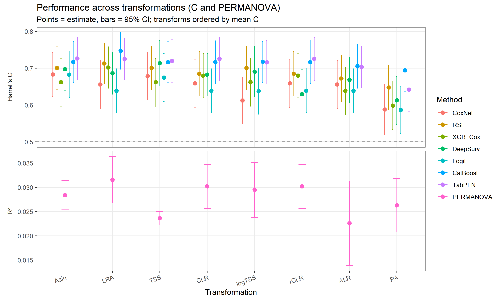
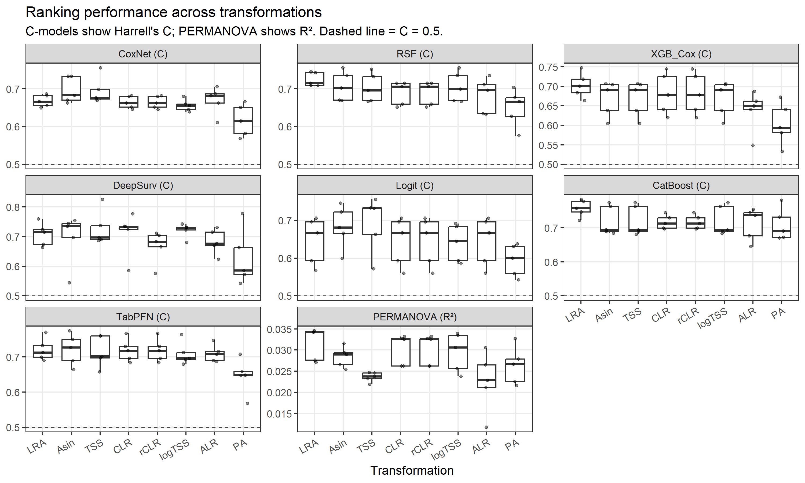

# Survivalanalysis using probabilistic models


Libararies

``` r
# Packages
library(tidyverse)
library(brms)
library(tidybayes)
library(ggplot2)
library(TreeSummarizedExperiment)
library(SingleCellExperiment)
library(posterior)
library(dplyr)
library(tidyr)
library(stringr)
library(survival)
library(survminer)
library(vegan)
library(mia)
library(bayesboot)
library(IDPSurvival)
library(Matrix)
library(patchwork)
library(pROC)
library(RColorBrewer) 
library(cmdstanr)
library(ranger)
library(fastshap)
library(timeROC)
library(xgboost)
library(matrixStats)
library(catboost)
library(reticulate)

# Load funcs
source("Funcs_cleaned.R")
```

Load models and combine

``` r
out_dir <- file.path("model_result", "shap_outputs")

# CoxNet
coxnet_metrics    <- readRDS(file.path(out_dir, "coxnet_metrics.rds"))
coxnet_shap_agg   <- readRDS(file.path(out_dir, "coxnet_shap_agg.rds"))
coxnet_shap_long  <- readRDS(file.path(out_dir, "coxnet_shap_long.rds"))
coxnet_foldC      <- readRDS(file.path(out_dir, "coxnet_foldC.rds"))

# RSF
rsf_metrics    <- readRDS(file.path(out_dir, "rsf_metrics.rds"))
rsf_shap_agg   <- readRDS(file.path(out_dir, "rsf_shap_agg.rds"))
rsf_shap_long  <- readRDS(file.path(out_dir, "rsf_shap_long.rds"))
rsf_foldC      <- readRDS(file.path(out_dir, "rsf_foldC.rds"))

# Logistic
logit_metrics   <- readRDS(file.path(out_dir, "logit_metrics.rds"))
logit_shap_agg  <- readRDS(file.path(out_dir, "logit_shap_agg.rds"))
logit_shap_long <- readRDS(file.path(out_dir, "logit_shap_long.rds"))
logit_foldC     <- readRDS(file.path(out_dir, "logit_foldC.rds"))

# CatBoost
cb_metrics    <- readRDS(file.path(out_dir, "cb_metrics.rds"))
cb_shap_agg   <- readRDS(file.path(out_dir, "cb_shap_agg.rds"))
cb_shap_long  <- readRDS(file.path(out_dir, "cb_shap_long.rds"))
cb_foldC      <- readRDS(file.path(out_dir, "cb_foldC.rds"))

# DeepSurv
deepsurv_metrics   <- readRDS(file.path(out_dir, "deepsurv_metrics.rds"))
deepsurv_shap_agg  <- readRDS(file.path(out_dir, "deepsurv_shap_agg.rds"))
deepsurv_shap_long <- readRDS(file.path(out_dir, "deepsurv_shap_long.rds"))
deepsurv_foldC     <- readRDS(file.path(out_dir, "deepsurv_foldC.rds"))

# XGBoost Cox
xgb_metrics    <- readRDS(file.path(out_dir, "xgb_metrics.rds"))
xgb_shap_agg   <- readRDS(file.path(out_dir, "xgb_shap_agg.rds"))
xgb_shap_long  <- readRDS(file.path(out_dir, "xgb_shap_long.rds"))
xgb_foldC      <- readRDS(file.path(out_dir, "xgb_foldC.rds"))

# TabPFN
tabpfn_metrics   <- readRDS(file.path(out_dir, "tabpfn_metrics.rds"))
tabpfn_shap_agg  <- readRDS(file.path(out_dir, "tabpfn_shap_agg.rds"))
tabpfn_shap_long <- readRDS(file.path(out_dir, "tabpfn_shap_long.rds"))
tabpfn_foldC     <- readRDS(file.path(out_dir, "tabpfn_foldC.rds"))

# PERMANOVA
permanova_metrics    <- readRDS(file.path(out_dir, "permanova_metrics.rds"))
permanova_foldR2     <- readRDS(file.path(out_dir, "permanova_foldR2.rds"))
permanova_shap_agg   <- readRDS(file.path(out_dir, "permanova_shap_agg.rds"))
permanova_shap_long  <- readRDS(file.path(out_dir, "permanova_shap_long.rds"))

# Combine overall metrics
metrics_all <- dplyr::bind_rows(
  coxnet_metrics, rsf_metrics, logit_metrics,
  cb_metrics, deepsurv_metrics, xgb_metrics, tabpfn_metrics,
  permanova_metrics
)

# Combine fold-wise C only
# PERMANOVA folds kept separate (used for R^2)
# permanova_foldR2
foldC_all <- dplyr::bind_rows(
  coxnet_foldC, rsf_foldC, logit_foldC,
  cb_foldC, deepsurv_foldC, xgb_foldC, tabpfn_foldC
)

# Combine SHAP (long/agg) across all models
shap_long_all <- dplyr::bind_rows(
  coxnet_shap_long, rsf_shap_long, logit_shap_long,
  cb_shap_long, deepsurv_shap_long, xgb_shap_long, tabpfn_shap_long,
  permanova_shap_long
)

shap_agg_all <- dplyr::bind_rows(
  coxnet_shap_agg, rsf_shap_agg, logit_shap_agg,
  cb_shap_agg, deepsurv_shap_agg, xgb_shap_agg, tabpfn_shap_agg,
  permanova_shap_agg
)
```

# Visualizations

## Performance across transformations

``` r
plot_df <- metrics_all %>%
  filter(metric %in% c("C","R2")) %>%
  mutate(
    method = factor(method,
                    levels = c("CoxNet","RSF","XGB_Cox","DeepSurv","Logit","CatBoost","TabPFN","PERMANOVA")
                    [c("CoxNet","RSF","XGB_Cox","DeepSurv","Logit","CatBoost","TabPFN","PERMANOVA") %in% method]
    ),
    metric_lbl = dplyr::recode(metric, C = "Harrell's C", R2 = "R²", .default = metric)
  )

# Order transformations by mean C across methods
model_order <- plot_df %>%
  filter(metric == "C") %>%
  group_by(model) %>%
  summarise(meanC = mean(estimate, na.rm = TRUE), .groups = "drop") %>%
  arrange(desc(meanC)) %>%
  pull(model)

plot_df <- plot_df %>% mutate(model = factor(model, levels = model_order))

# Plot
ggplot(plot_df, aes(x = model, y = estimate, color = method)) +
  geom_hline(
    data = dplyr::tibble(metric_lbl = "Harrell's C", y = 0.5),
    mapping = aes(yintercept = y),
    linetype = "dashed", linewidth = 0.5, alpha = 0.7
  ) +
  geom_errorbar(aes(ymin = lower, ymax = upper),
                position = position_dodge(width = 0.6), width = 0.15, linewidth = 0.5) +
  geom_point(position = position_dodge(width = 0.6), size = 2.8, stroke = 0.2) +
  facet_grid(rows = vars(metric_lbl), scales = "free_y", switch = "y") +
  labs(
    title = "Performance across transformations (C and PERMANOVA)",
    subtitle = "Points = estimate, bars = 95% CI; transforms ordered by mean C",
    x = "Transformation", y = NULL, color = "Method"
  ) +
  theme_bw() +
  theme(
    axis.text.x = element_text(angle = 20, hjust = 1),
    panel.grid.minor = element_blank(),
    strip.placement = "outside",
    strip.background = element_rect(fill = NA, color = NA)
  )
```



PERMANOVA is permutation-based, so its 95% CIs reflect K-fold variability rather than an asymptotic SE. In contrast, the other models report asymptotic 95% CIs (from the concordance estimator), so the intervals aren’t directly comparable.

``` r
# Build folds for C-models
c_folds <- foldC_all %>%
  transmute(transform = model, method, fold, value = as.numeric(C), metric = "C")

# Build folds for PERMANOVA
r2_folds <- permanova_foldR2 %>%
  transmute(transform = model, method, fold, value = as.numeric(R2), metric = "R2")

# Combine
folds_all <- bind_rows(c_folds, r2_folds) %>%
  filter(is.finite(value)) %>%
  mutate(
    method_lab = ifelse(method == "PERMANOVA", "PERMANOVA (R²)", paste0(method, " (C)"))
  )

# Order models
method_order <- c("CoxNet","RSF","XGB_Cox","DeepSurv","Logit","CatBoost","TabPFN")
present_c_methods <- unique(folds_all$method[folds_all$metric == "C"])
lvl_c <- paste0(method_order[method_order %in% present_c_methods], " (C)")
lvl_all <- c(lvl_c, "PERMANOVA (R²)")
folds_all$method_lab <- factor(folds_all$method_lab, levels = lvl_all[lvl_all %in% folds_all$method_lab])

# Order transforms by median C across C-models
t_order <- c_folds %>%
  group_by(transform) %>%
  summarise(medC = median(value, na.rm = TRUE), .groups = "drop") %>%
  arrange(desc(medC)) %>% pull(transform)
folds_all$transform <- factor(folds_all$transform, levels = t_order)

# Dashed baseline only on C panels
hline_df <- folds_all %>%
  filter(metric == "C") %>%
  distinct(method_lab) %>%
  mutate(y = 0.5)

# Plot
ggplot(folds_all, aes(x = transform, y = value)) +
  geom_hline(data = hline_df, aes(yintercept = y),
             linetype = "dashed", linewidth = 0.4, alpha = 0.7) +
  geom_boxplot(outlier.shape = NA, width = 0.65) +
  geom_jitter(width = 0.15, height = 0, size = 1, alpha = 0.45) +
  facet_wrap(~ method_lab, scales = "free_y", ncol = 3) +
  labs(
    title = "Ranking performance across transformations",
    subtitle = "C-models show Harrell's C; PERMANOVA shows R². Dashed line = C = 0.5.",
    x = "Transformation", y = NULL
  ) +
  theme_bw() +
  theme(
    panel.grid.minor = element_blank(),
    axis.text.x = element_text(angle = 30, hjust = 1),
    legend.position = "none"
  )
```



## Shapley heatmap

``` r
# Settings
tau <- 0

coverage_tbl <- shap_long_all %>%
  group_by(model_key, transform, feature) %>%
  summarise(hit = any(abs(shap) > tau, na.rm = TRUE), .groups = "drop") %>%
  group_by(model_key, transform) %>%
  summarise(
    coverage   = mean(hit),
    n_features = dplyr::n(),
    .groups = "drop"
  )

coverage_tbl$transform <- factor(coverage_tbl$transform, levels = unique(coverage_tbl$transform))
coverage_tbl$model_key <- factor(coverage_tbl$model_key, levels = rev(unique(coverage_tbl$model_key)))

# Plot
ggplot(coverage_tbl, aes(x = transform, y = model_key, fill = coverage)) +
  geom_tile() +
  scale_fill_viridis_c(name = "Coverage", limits = c(0, 1)) +
  labs(
    title = "SHAP coverage",
    subtitle = "Coverage = proportion of features with abs(SHAP) > 0",
    x = "Transform", y = "Model"
  ) +
  theme_minimal() +
  theme(axis.text.x = element_text(angle = 45, hjust = 1),
        panel.grid = element_blank())
```


With a zero threshold, most models light up almost all features; CoxNet prunes the most, with XGBoost and Logit trimming some as well.
