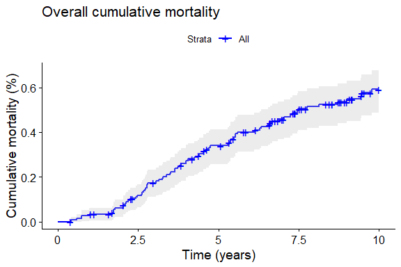
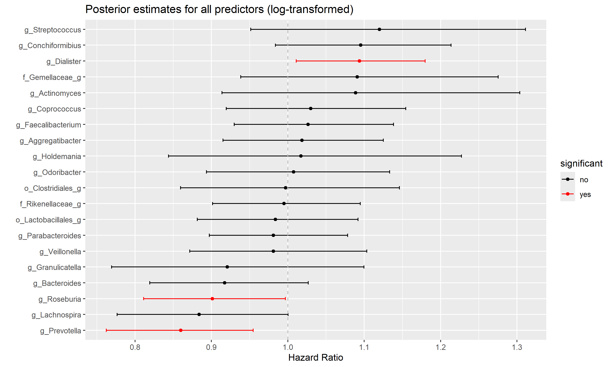
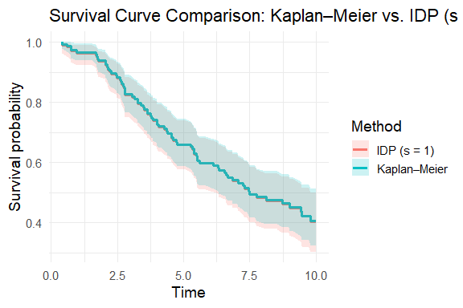

# Survivalanalysis using probabilistic models


# Introduction

Let’s download all the necessary libraries:

``` r
library(tidyverse)
library(brms)
library(tidybayes)
library(ggplot2)
library(TreeSummarizedExperiment)
library(posterior)
library(dplyr)
library(tidyr)
library(stringr)
library(survival)
library(survminer)
library(vegan)
library(mia)
library(bayesboot)
library(IDPSurvival)
library(cmdstanr)
```

# Survival model

## Data manipulation

All data preprocessing was carried out in a separate script (`data.R`) to ensure clarity and modularity in the analysis workflow. The script loads the raw data, applies appropriate transformations, removes invalid samples, and derives variables needed for modeling.

To reduce dimensionality and avoid overfitting in probabilistic survival modeling, only the 5 most prevalent microbial taxa were selected based on their presence across samples. This targeted feature selection improves the robustness and interpretability of the model, especially given the relatively limited sample size.

## Modeling

We construct a Cox model formula using the log-transformed predictors already available in dff. A probabilistic Cox proportional hazards model is then fitted using brm(), with a normal(0, 1) prior on each bacterial coefficient to reflect weak prior knowledge. All of this is implemented in a separate script (`model.R`), and we now load the results.

``` r
# Load model
fit_brms <- readRDS("fit_brms.rds")
```

We take summary of the model.

``` r
# Print model summary
summary(fit_brms)
```

     Family: cox 
      Links: mu = log 
    Formula: Event_time | cens(1 - Event) ~ g_Bacteroides + f_Lachnospiraceae_g + f_Enterobacteriaceae_g + g_Ruminococcus + o_Clostridiales_g 
       Data: df (Number of observations: 150) 
      Draws: 4 chains, each with iter = 4000; warmup = 2000; thin = 1;
             total post-warmup draws = 8000

    Regression Coefficients:
                           Estimate Est.Error l-95% CI u-95% CI Rhat Bulk_ESS
    Intercept                  0.41      0.46    -0.49     1.30 1.00     8037
    g_Bacteroides             -0.13      0.06    -0.25    -0.00 1.00     6997
    f_Lachnospiraceae_g        0.20      0.14    -0.09     0.48 1.00     5925
    f_Enterobacteriaceae_g     0.12      0.06     0.00     0.23 1.00     8540
    g_Ruminococcus             0.04      0.09    -0.13     0.22 1.00     7719
    o_Clostridiales_g         -0.10      0.10    -0.29     0.11 1.00     6990
                           Tail_ESS
    Intercept                  6136
    g_Bacteroides              5550
    f_Lachnospiraceae_g        5438
    f_Enterobacteriaceae_g     6040
    g_Ruminococcus             6129
    o_Clostridiales_g          5634

    Draws were sampled using sampling(NUTS). For each parameter, Bulk_ESS
    and Tail_ESS are effective sample size measures, and Rhat is the potential
    scale reduction factor on split chains (at convergence, Rhat = 1).

The model shows good convergence diagnostics. All Rhat values are equal to 1.00, indicating that the chains have converged well. Additionally, both Bulk and Tail Effective Sample Sizes (ESS) are high across all parameters, suggesting that the posterior distributions are well estimated and the sampling was efficient.

Posterior samples of the coefficients are extracted and summarized by computing the median, 2.5%, and 97.5% quantiles, forming the 95% credible interval for each predictor.

``` r
# Extract raw draws as dataframe
draws_df <- as_draws_df(fit_brms)

# Select only b_ variables, excluding intercept
posterior_summary <- draws_df %>%
  select(starts_with("b_")) %>%
  select(-b_Intercept) %>%
  pivot_longer(everything(), names_to = "variable", values_to = "value") %>%
  group_by(variable) %>%
  summarise(
    median = median(value),
    lower = quantile(value, 0.025),
    upper = quantile(value, 0.975)
  ) %>%
  mutate(variable_clean = str_remove(variable, "b_"))


# Add significance column (if 95% CI does not include 0, (log(HR)=0))
posterior_summary <- posterior_summary %>%
  mutate(significant = ifelse(lower > 0 | upper < 0, "yes", "no"))
```

## Visualization

The exponentiated posterior medians and credible intervals are plotted as hazard ratios. Predictors whose intervals do not cross 1 (indicating statistical relevance) are highlighted in red, and others in black. The plot is sorted by effect size.

``` r
# Plot hazard ratios
ggplot(posterior_summary, aes(y = reorder(variable_clean, median), 
                              x = exp(median), 
                              xmin = exp(lower), 
                              xmax = exp(upper), 
                              color = significant)) +
  geom_point() +
  geom_errorbarh(height = 0.2) +
  geom_vline(xintercept = 1, linetype = "dashed", color = "gray") +
  scale_color_manual(values = c("yes" = "red", "no" = "black")) +
  labs(x = "Hazard Ratio", y = "", title = "Posterior estimates for all predictors (log-transformed)")
```


This figure displays the posterior estimates of hazard ratios for all log-transformed bacterial predictors. Each point represents the median of the posterior distribution, and the horizontal lines show the 95% credible intervals. Predictors highlighted in red are statistically significant, meaning their credible intervals do not include 1.

Hazard ratios below 1 (to the left of the dashed line) are associated with a reduced risk of mortality, while those above 1 suggest an increased risk. In this model, most predictors show no statistically significant association with mortality; only g_Bacteroides demonstrates a significant effect, indicating a potential reduce in risk.

# Survival curves

## Kaplan-Meier curve

First classical Kaplan–Meier estimator is applied to provide a robust and interpretable nonparametric summary of cumulative mortality over time.

``` r
# Fit Kaplan-Meier survival model
surv_fit <- survfit(Surv(Event_time, Event) ~ 1, data = df)

# Plot cumulative mortality curve
ggsurvplot(
  surv_fit,
  data = df,
  conf.int = TRUE,
  fun = "event",  
  palette = "blue",
  xlab = "Time (years)",
  ylab = "Cumulative mortality (%)",
  title = "Overall cumulative mortality"
)
```



This plot shows the overall cumulative mortality over a 10-year follow-up period. The curve represents the estimated probability of death over time in the entire cohort. The shaded area around the curve indicates the 95% confidence interval, and the small vertical ticks represent censored observations. By the end of the follow-up, cumulative mortality reaches approximately 60%, with a fairly steady increase over time.

## Probabilistic Survival Curve with IDPSurvival

We now estimate a probabilistic survival curve using the `isurvfit()` function from the `IDPSurvival` package. This method is based on the Imprecise Dirichlet Process, which provides robust survival estimates with uncertainty bounds, especially useful for small or uncertain datasets.

``` r
# Create the Surv object
surv_obj <- Surv(time = df$Event_time, event = df$Event)

# Estimate the IDP survival curve
fit <- isurvfit(surv_obj ~ 1, data = df, s = 1, 
                conf.type = "exact", nsamples = 2000, display = FALSE)

# Plot the survival curve
plot(fit)
title("Probabilistic Survival Curve (IDP)")
mtext("Time (years)", side = 1, line = 2)
mtext("Survival probability", side = 2, line = 2)
legend('bottomleft', c("Lower expectation",
          "Upper expectation","Confidence intervals"), lty=c(1,1,2),lwd=c(1,2,1))
```



The parameter `s = 1` controls the strength of the prior. A higher `s` reflects more confidence in the prior and results in narrower uncertainty bands. Conversely, lower values of `s` allow for more imprecision, widening the interval between lower and upper expectations. The parameter `nsamples = 2000` specifies the number of posterior samples used to construct the credible intervals. A larger value gives a smoother and more stable estimate of the uncertainty region. The `conf.type = "exact"` option determines how the uncertainty bounds are calculated. When set to `"exact"`, the intervals are computed using the full posterior distribution.

## Comparison of Classical and Probabilistic Survival Estimation Methods

To better understand the differences between classical and probabilistic survival estimates, we compare the Kaplan–Meier curve with the survival curve derived from the Imprecise Dirichlet Process approach.

``` r
# Fit the classical Kaplan–Meier survival model
km_fit <- survfit(Surv(Event_time, Event) ~ 1, data = df)

# Fit the probabilistic IDP survival model (s = 1)
idp_fit <- isurvfit(Surv(Event_time, Event) ~ 1, data = df, s = 1,
                    conf.type = "exact", nsamples = 2000, display = FALSE)

# Prepare Kaplan–Meier survival curve data
km_df <- data.frame(
  time = km_fit$time,
  surv = km_fit$surv,
  lower = km_fit$lower,
  upper = km_fit$upper,
  method = "Kaplan–Meier"
)

# Prepare IDP survival curve data using midpoint between lower and upper expectations
idp_df <- data.frame(
  time = idp_fit$time,
  surv = (idp_fit$survUP + idp_fit$survLOW) / 2,
  lower = idp_fit$lower,
  upper = idp_fit$upper,
  method = "IDP (s = 1)"
)

# Combine the datasets for plotting
combined_df <- bind_rows(km_df, idp_df)

# Plot the survival curves
ggplot(combined_df, aes(x = time, y = surv, color = method, fill = method)) +
  geom_step(linewidth = 1.2) +
  geom_ribbon(aes(ymin = lower, ymax = upper), alpha = 0.2, color = NA) +
  labs(
    title = "Survival Curve Comparison: Kaplan–Meier vs. IDP (s = 1)",
    x = "Time",
    y = "Survival probability",
    color = "Method",
    fill = "Method"
  ) +
  theme_minimal(base_size = 14)
```



The point estimates from the IDP and Kaplan–Meier methods are very similar, but the uncertainty band from the IDP model lies slightly lower than uncertainty band from the Kaplan-Meier.

# Comparison of CLR, rCLR, and Log-Relative-Abundance Transformations Using Microbial Log-Ratio Features in Survival Analysis

To evaluate the impact of compositional preprocessing choices, we compare three common transformations: centered log-ratio (CLR), robust CLR (rCLR), and log-relative-abundance (LRA). Using the 20 most prevalent microbial taxa, we compute all pairwise log(x/y) ratios as input features for survival modeling.

The log(x/y) transformation expresses the relative abundance of one taxon compared to another on a log scale, making the data more statistically appropriate for modeling and removing compositional constraints. These features are used in Bayesian Cox models, and the predictive performance of all three models is compared using leave-one-out cross-validation (LOO).

As a baseline reference, we also include a model using log-transformed absolute abundances (without any ratio transformation) of the same 20 taxa. This provides a point of comparison to assess whether ratio-based features offer an advantage over simpler log-abundance inputs in survival prediction.

``` r
# Count how many observations have pareto_k > 0.7 per model
sapply(loos, function(x) sum(x$diagnostics$pareto_k > 0.7))
```

      lra   clr  rclr abund 
        1     0     0     0 

``` r
# Print the results
print(loo_comp)
```

                    elpd_diff se_diff
    fit_lra_ratios   0.0       0.0   
    fit_clr         -0.1       0.7   
    fit_rclr        -0.8       0.7   
    fit_abund_top20 -2.8       1.1   

After applying moment matching to improve the reliability of the leave-one-out estimates, all Pareto $k$ values were below the diagnostic threshold of $0.7$, except for a single observation in the LRA-based model. This indicates that the LOO estimates are reliable and can be used for model comparison.

The LRA, CLR, and rCLR models showed very similar predictive performance, with elpd differences well within one standard error. This suggests that the specific choice of log-ratio transformation does not meaningfully affect predictive accuracy in this setting.

However, the model based on raw log-transformed abundances of the top 20 taxa (without log-ratios) performed notably worse than the LRA model, with an estimated ELPD difference that exceeds one standard error. This suggests a meaningful decline in predictive performance when ratio-based features are not used.

The CLR- and rCLR-based models included 20 transformed taxa as predictors, whereas the LRA-based model incorporated 190 pairwise log-ratio features derived from the same 20 taxa. This led to a substantial increase in dimensionality for the LRA model, although model fitting remained relatively fast and stable.
