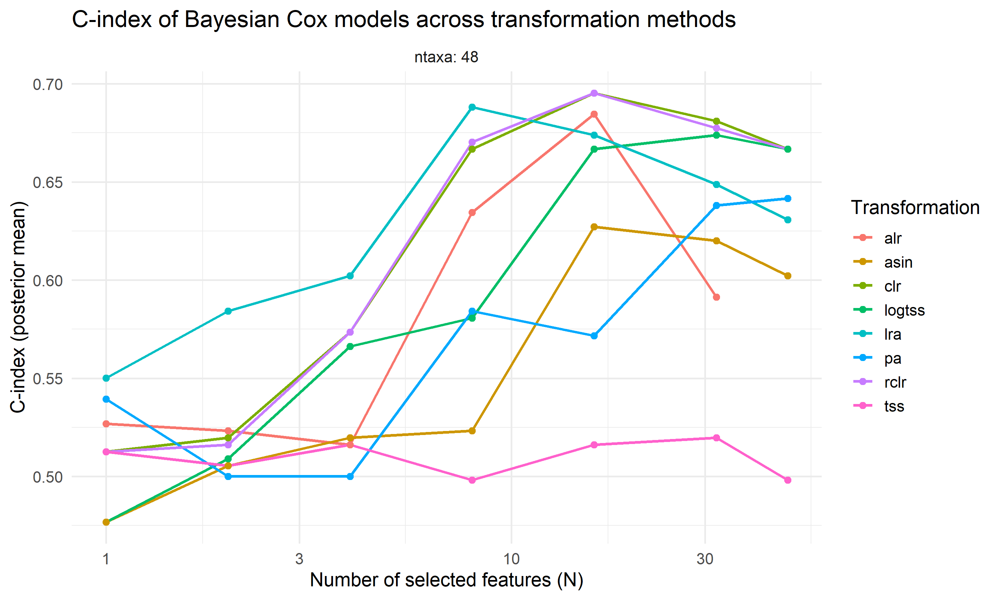
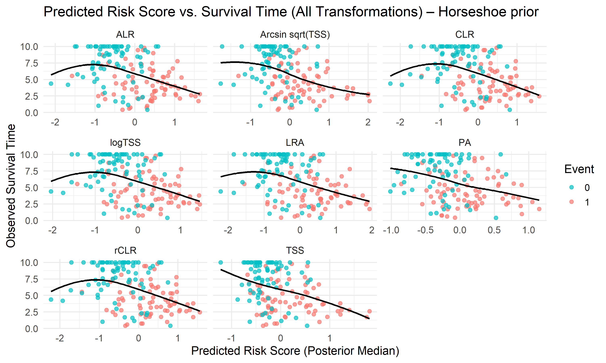

# Survivalanalysis using probabilistic models


# Introduction

Let’s download all the necessary libraries:

``` r
library(tidyverse)
library(brms)
library(tidybayes)
library(ggplot2)
library(TreeSummarizedExperiment)
library(posterior)
library(dplyr)
library(tidyr)
library(stringr)
library(survival)
library(survminer)
library(vegan)
library(mia)
library(bayesboot)
library(IDPSurvival)
library(cmdstanr)
```

## Data manipulation

All data preprocessing was carried out in a separate script (`data.R`) to ensure clarity and modularity in the analysis workflow. The script loads the raw data, applies appropriate transformations, removes invalid samples, and derives variables needed for modeling.

# Optimizing Feature Count for Survival Prediction

In this analysis, we systematically evaluate how the number of input features affects the predictive performance of Bayesian survival models. Starting from a single feature and increasing the count in powers of two up to a predefined maximum, we compare model performance using the concordance index (C-index) across multiple data transformations. This approach helps identify a potential “sweet spot” where the model achieves high performance with a minimal and interpretable feature set, before diminishing returns or overfitting may occur.

To analyze how predictive performance varies across transformations and different numbers of selected features, we reorganize the model results into a long-format data frame. This structure facilitates visualization and comparison across transformation methods and feature subset sizes. Each row represents a single model fit, annotated with the number of features used (`N`), the transformation method applied, and the number of taxa (`ntaxa`) considered in the subset.

``` r
# Reshape results into long format
res_brm_df <- purrr::imap_dfr(res_brm_result, function(method_list, ntaxa_name) {
  ntaxa_val <- as.numeric(gsub("ntaxa_", "", ntaxa_name))
  purrr::imap_dfr(method_list, function(df, method_name) {
    df %>%
      mutate(
        ntaxa = ntaxa_val,
        method = method_name
      )
  })
})

# Visualize C-index values across transformation methods and feature counts
ggplot(res_brm_df, aes(x = N, y = C_index, color = method)) +
  geom_line(linewidth = 1) +
  geom_point(size = 2) +
  facet_wrap(~ ntaxa, labeller = label_both, scales = "free_y") +
  labs(
    title = "C-index of Bayesian Cox models across transformation methods",
    x = "Number of selected features (N)",
    y = "C-index (posterior mean)",
    color = "Transformation"
  ) +
  scale_x_log10() +
  theme_minimal(base_size = 14)
```



Model performance, measured by the C-index, improves as more features are included but levels off around 20 features. After that, additional features offer no benefit. This suggests that using about 20 top features is a good balance between simplicity and performance.

# Survival model

To reduce dimensionality and avoid overfitting in probabilistic survival modeling, the 20 most informative microbial features were selected based on univariate association with the outcome. This targeted feature selection improves the robustness and interpretability of the model, especially given the relatively limited sample size.

## Modeling

We construct a Cox model formula using the log-transformed predictors already available in dff. A probabilistic Cox proportional hazards model is then fitted using brm(), with a normal(0, 1) prior on each bacterial coefficient to reflect weak prior knowledge. All of this is implemented in a separate script (`model.R`), and we now load the results.

We take summary of the model.

``` r
# Print model summary
summary(fit_abund)
```

     Family: cox 
      Links: mu = log 
    Formula: Event_time | cens(1 - Event) ~ g_Streptococcus + g_Bacteroides + g_Roseburia + g_Dialister + g_Lachnospira + f_Gemellaceae_g + g_Faecalibacterium + g_Actinomyces + g_Granulicatella + g_Prevotella + g_Conchiformibius + f_Rikenellaceae_g + o_Clostridiales_g + o_Lactobacillales_g + g_Holdemania + g_Coprococcus + g_Parabacteroides + g_Aggregatibacter + g_Odoribacter + g_Veillonella 
       Data: df (Number of observations: 150) 
      Draws: 4 chains, each with iter = 4000; warmup = 2000; thin = 1;
             total post-warmup draws = 8000

    Regression Coefficients:
                        Estimate Est.Error l-95% CI u-95% CI Rhat Bulk_ESS Tail_ESS
    Intercept               0.74      1.28    -1.80     3.26 1.00     8116     7159
    g_Streptococcus         0.11      0.08    -0.05     0.27 1.00     6032     5417
    g_Bacteroides          -0.09      0.06    -0.20     0.03 1.00     7049     5895
    g_Roseburia            -0.10      0.05    -0.21    -0.00 1.00     8237     5457
    g_Dialister             0.09      0.04     0.01     0.17 1.00     7923     5944
    g_Lachnospira          -0.12      0.06    -0.25     0.00 1.00     9309     6440
    f_Gemellaceae_g         0.09      0.08    -0.06     0.24 1.00     6694     5506
    g_Faecalibacterium      0.03      0.05    -0.07     0.13 1.00     8018     6058
    g_Actinomyces           0.09      0.09    -0.09     0.27 1.00     7683     6574
    g_Granulicatella       -0.08      0.09    -0.26     0.10 1.00     7618     6141
    g_Prevotella           -0.15      0.06    -0.27    -0.05 1.00     7409     5715
    g_Conchiformibius       0.09      0.05    -0.02     0.19 1.00    10379     6406
    f_Rikenellaceae_g      -0.01      0.05    -0.10     0.09 1.00     7953     6357
    o_Clostridiales_g      -0.00      0.07    -0.15     0.14 1.00     7803     5898
    o_Lactobacillales_g    -0.02      0.05    -0.13     0.09 1.00     8603     6184
    g_Holdemania            0.02      0.10    -0.17     0.20 1.00     7918     5773
    g_Coprococcus           0.03      0.06    -0.08     0.14 1.00     8019     5664
    g_Parabacteroides      -0.02      0.05    -0.11     0.08 1.00     8674     6190
    g_Aggregatibacter       0.02      0.05    -0.09     0.12 1.00     8094     6251
    g_Odoribacter           0.01      0.06    -0.11     0.13 1.00     7688     6234
    g_Veillonella          -0.02      0.06    -0.14     0.10 1.00     8629     6303

    Draws were sampled using sampling(NUTS). For each parameter, Bulk_ESS
    and Tail_ESS are effective sample size measures, and Rhat is the potential
    scale reduction factor on split chains (at convergence, Rhat = 1).

The model shows good convergence diagnostics. All Rhat values are equal to 1.00, indicating that the chains have converged well. Additionally, both Bulk and Tail Effective Sample Sizes (ESS) are high across all parameters, suggesting that the posterior distributions are well estimated and the sampling was efficient.

Posterior samples of the coefficients are extracted and summarized by computing the median, 2.5%, and 97.5% quantiles, forming the 95% credible interval for each predictor.

``` r
# Extract raw draws as dataframe
draws_df <- as_draws_df(fit_abund)

# Select only b_ variables, excluding intercept
posterior_summary <- draws_df %>%
  select(starts_with("b_")) %>%
  select(-b_Intercept) %>%
  pivot_longer(everything(), names_to = "variable", values_to = "value") %>%
  group_by(variable) %>%
  summarise(
    median = median(value),
    lower = quantile(value, 0.025),
    upper = quantile(value, 0.975)
  ) %>%
  mutate(variable_clean = str_remove(variable, "b_"))


# Add significance column (if 95% CI does not include 0)
posterior_summary <- posterior_summary %>%
  mutate(significant = ifelse(lower > 0 | upper < 0, "yes", "no"))
```

## Visualization

The posterior medians and credible intervals are plotted as hazard ratios. Predictors whose intervals do not cross 1 (indicating statistical relevance) are highlighted in red, and others in black. The plot is sorted by effect size.

``` r
# Plot hazard ratios
ggplot(posterior_summary, aes(y = reorder(variable_clean, median), 
                              x = exp(median), 
                              xmin = exp(lower), 
                              xmax = exp(upper), 
                              color = significant)) +
  geom_point() +
  geom_errorbarh(height = 0.2) +
  geom_vline(xintercept = 1, linetype = "dashed", color = "gray") +
  scale_color_manual(values = c("yes" = "red", "no" = "black")) +
  labs(x = "Hazard Ratio", y = "", title = "Posterior estimates for all predictors (log-transformed)")
```


This figure shows posterior hazard ratio estimates for log-transformed microbial predictors. Points indicate posterior medians; lines represent 95% credible intervals. Predictors in red are statistically significant (credible interval excludes 1).

Among significant taxa, g_Dialister has a hazard ratio above 1, suggesting an increased risk. In contrast, g_Roseburia and g_Prevotella are associated with decreased risk (hazard ratio \< 1).

## CLR-transformed modeling

In another model, we used the top microbial features based on their individual associations with the outcome. Before fitting the model, we applied a centered log-ratio (CLR) transformation to express each microbe’s level in relation to the others. This helps make the results easier to interpret and reduces the chance of misleading correlations.

We take summary of the model.

``` r
# Print model summary
summary(fit_clr)
```

     Family: cox 
      Links: mu = log 
    Formula: Event_time | cens(1 - Event) ~ g_Streptococcus + g_Bacteroides + g_Roseburia + g_Dialister + g_Lachnospira + f_Gemellaceae_g + g_Actinomyces + g_Faecalibacterium + g_Granulicatella + o_Clostridiales_g + g_Prevotella + g_Conchiformibius + f_Rikenellaceae_g + g_Coprococcus + o_Lactobacillales_g + g_Holdemania + g_Parabacteroides + g_Aggregatibacter + g_Veillonella + g_Odoribacter 
       Data: df (Number of observations: 150) 
      Draws: 4 chains, each with iter = 4000; warmup = 2000; thin = 1;
             total post-warmup draws = 8000

    Regression Coefficients:
                        Estimate Est.Error l-95% CI u-95% CI Rhat Bulk_ESS Tail_ESS
    Intercept               0.41      0.58    -0.78     1.50 1.00    10415     7333
    g_Streptococcus         0.15      0.12    -0.08     0.37 1.00     7195     6104
    g_Bacteroides          -0.15      0.09    -0.32     0.02 1.00     7462     5562
    g_Roseburia            -0.16      0.07    -0.30    -0.02 1.00     9138     6897
    g_Dialister             0.11      0.06    -0.01     0.23 1.00     8835     6701
    g_Lachnospira          -0.20      0.10    -0.39    -0.02 1.00     9816     6307
    f_Gemellaceae_g         0.11      0.11    -0.11     0.33 1.00     7915     6758
    g_Actinomyces           0.07      0.14    -0.19     0.34 1.00     7951     6391
    g_Faecalibacterium      0.03      0.07    -0.11     0.18 1.00     8569     5946
    g_Granulicatella       -0.13      0.13    -0.39     0.12 1.00     7681     6713
    o_Clostridiales_g      -0.05      0.12    -0.27     0.18 1.00     8012     6443
    g_Prevotella           -0.23      0.09    -0.41    -0.07 1.00     9170     5706
    g_Conchiformibius       0.11      0.08    -0.05     0.26 1.00     8179     6070
    f_Rikenellaceae_g      -0.03      0.07    -0.17     0.12 1.00     7802     5839
    g_Coprococcus           0.02      0.09    -0.15     0.19 1.00     7232     6503
    o_Lactobacillales_g    -0.05      0.08    -0.21     0.10 1.00     7239     6271
    g_Holdemania            0.02      0.13    -0.24     0.27 1.00     8723     6753
    g_Parabacteroides      -0.04      0.07    -0.17     0.10 1.00     9826     6241
    g_Aggregatibacter       0.01      0.08    -0.14     0.16 1.00     7487     6193
    g_Veillonella          -0.04      0.08    -0.20     0.13 1.00     8831     6564
    g_Odoribacter           0.00      0.08    -0.16     0.17 1.00     7703     6520

    Draws were sampled using sampling(NUTS). For each parameter, Bulk_ESS
    and Tail_ESS are effective sample size measures, and Rhat is the potential
    scale reduction factor on split chains (at convergence, Rhat = 1).

The model shows good convergence diagnostics. All Rhat values are equal to 1.00, indicating that the chains have converged well. Additionally, both Bulk and Tail Effective Sample Sizes (ESS) are high across all parameters, suggesting that the posterior distributions are well estimated and the sampling was efficient.

Posterior samples of the coefficients are extracted and summarized by computing the median, 2.5%, and 97.5% quantiles, forming the 95% credible interval for each predictor.

``` r
# Extract raw draws as dataframe
draws_df_clr <- as_draws_df(fit_clr)

# Select only b_ variables, excluding intercept
posterior_summary_clr <- draws_df_clr %>%
  select(starts_with("b_")) %>%
  select(-b_Intercept) %>%
  pivot_longer(everything(), names_to = "variable", values_to = "value") %>%
  group_by(variable) %>%
  summarise(
    median = median(value),
    lower = quantile(value, 0.025),
    upper = quantile(value, 0.975)
  ) %>%
  mutate(variable_clean = str_remove(variable, "b_")) %>%
  mutate(significant = ifelse(lower > 0 | upper < 0, "yes", "no"))
```

The posterior medians and credible intervals are plotted as hazard ratios as earlier.

``` r
# Plot
ggplot(posterior_summary_clr, aes(y = reorder(variable_clean, median), 
                              x = exp(median), 
                              xmin = exp(lower), 
                              xmax = exp(upper), 
                              color = significant)) +
  geom_point() +
  geom_errorbarh(height = 0.2) +
  geom_vline(xintercept = 1, linetype = "dashed", color = "gray") +
  scale_color_manual(values = c("yes" = "red", "no" = "black")) +
  labs(x = "Hazard Ratio", y = "", title = "Posterior estimates for all predictors (CLR-transformed)")
```


As in the log-abundance model, g\_\_Roseburia and g\_\_Prevotella are significantly associated with reduced hazard (HR \< 1), suggesting a potential protective effect. In addition, g\_\_Lachnospira also shows a negative association with risk. The remaining taxa do not display clear associations with the outcome.

## LRA-based modeling

We also built a survival model using pairwise log-ratios between selected microbial taxa. This method focuses on the balance between microbes instead of looking at their individual levels. It helps reduce misleading associations and gives a clearer picture of how microbes relate to the outcome relative to one another.

We take summary of the model.

``` r
# Print model summary
summary(fit_lra)
```

     Family: cox 
      Links: mu = log 
    Formula: Event_time | cens(1 - Event) ~ diff_g_Lachnospirag_Streptococcus + diff_g_Dialisterg_Roseburia + diff_g_Prevotellag_Streptococcus + diff_g_Roseburiag_Streptococcus + diff_g_Dialistero_Clostridiales_g + diff_g_Dialisterg_Lachnospira + diff_g_Bacteroidesg_Streptococcus + diff_o_Clostridiales_g_g_Streptococcus + diff_f_Gemellaceae_g_g_Lachnospira + diff_g_Bacteroidesf_Gemellaceae_g + diff_g_Faecalibacteriumg_Streptococcus + diff_g_Streptococcusg_Holdemania + diff_g_Dialisterg_Prevotella + diff_g_Bacteroidesg_Dialister + diff_f_Gemellaceae_g_g_Prevotella + diff_g_Faecalibacteriumg_Dialister + diff_g_Bacteroidesg_Conchiformibius + diff_g_Actinomycesg_Roseburia + diff_g_Bacteroidesg_Granulicatella + diff_f_Peptostreptococcaceae_g_g_Streptococcus 
       Data: df (Number of observations: 150) 
      Draws: 4 chains, each with iter = 4000; warmup = 2000; thin = 1;
             total post-warmup draws = 8000

    Regression Coefficients:
                                                   Estimate Est.Error l-95% CI
    Intercept                                          0.47      0.55    -0.66
    diff_g_Lachnospirag_Streptococcus                 -0.02      0.73    -1.48
    diff_g_Dialisterg_Roseburia                       -0.03      0.63    -1.27
    diff_g_Prevotellag_Streptococcus                  -0.04      0.73    -1.49
    diff_g_Roseburiag_Streptococcus                    0.04      0.63    -1.21
    diff_g_Dialistero_Clostridiales_g                 -0.01      0.66    -1.30
    diff_g_Dialisterg_Lachnospira                      0.04      0.72    -1.37
    diff_g_Bacteroidesg_Streptococcus                 -0.05      0.73    -1.47
    diff_o_Clostridiales_g_g_Streptococcus             0.03      0.66    -1.25
    diff_f_Gemellaceae_g_g_Lachnospira                 0.02      0.66    -1.27
    diff_g_Bacteroidesf_Gemellaceae_g                 -0.02      0.67    -1.37
    diff_g_Faecalibacteriumg_Streptococcus            -0.00      0.64    -1.28
    diff_g_Streptococcusg_Holdemania                  -0.03      0.07    -0.17
    diff_g_Dialisterg_Prevotella                       0.07      0.73    -1.37
    diff_g_Bacteroidesg_Dialister                     -0.05      0.73    -1.46
    diff_f_Gemellaceae_g_g_Prevotella                  0.06      0.67    -1.23
    diff_g_Faecalibacteriumg_Dialister                 0.01      0.64    -1.25
    diff_g_Bacteroidesg_Conchiformibius               -0.08      0.04    -0.17
    diff_g_Actinomycesg_Roseburia                      0.14      0.09    -0.03
    diff_g_Bacteroidesg_Granulicatella                 0.09      0.08    -0.08
    diff_f_Peptostreptococcaceae_g_g_Streptococcus    -0.11      0.05    -0.21
                                                   u-95% CI Rhat Bulk_ESS Tail_ESS
    Intercept                                          1.51 1.00     8846     7290
    diff_g_Lachnospirag_Streptococcus                  1.41 1.00     8828     5282
    diff_g_Dialisterg_Roseburia                        1.16 1.00     7266     5741
    diff_g_Prevotellag_Streptococcus                   1.35 1.00     8432     5505
    diff_g_Roseburiag_Streptococcus                    1.25 1.00     7308     5761
    diff_g_Dialistero_Clostridiales_g                  1.25 1.00     7741     5306
    diff_g_Dialisterg_Lachnospira                      1.49 1.00     8580     5752
    diff_g_Bacteroidesg_Streptococcus                  1.39 1.00     8706     5675
    diff_o_Clostridiales_g_g_Streptococcus             1.30 1.00     7755     5645
    diff_f_Gemellaceae_g_g_Lachnospira                 1.32 1.00     8377     5791
    diff_g_Bacteroidesf_Gemellaceae_g                  1.29 1.00     8006     5584
    diff_g_Faecalibacteriumg_Streptococcus             1.28 1.00     7711     5093
    diff_g_Streptococcusg_Holdemania                   0.11 1.00    11258     5659
    diff_g_Dialisterg_Prevotella                       1.52 1.00     8721     5778
    diff_g_Bacteroidesg_Dialister                      1.38 1.00     8766     5805
    diff_f_Gemellaceae_g_g_Prevotella                  1.37 1.00     8144     5571
    diff_g_Faecalibacteriumg_Dialister                 1.28 1.00     7696     5376
    diff_g_Bacteroidesg_Conchiformibius                0.01 1.00    10994     5773
    diff_g_Actinomycesg_Roseburia                      0.30 1.00     9872     6662
    diff_g_Bacteroidesg_Granulicatella                 0.25 1.00    11197     6383
    diff_f_Peptostreptococcaceae_g_g_Streptococcus    -0.01 1.00    12066     5941

    Draws were sampled using sampling(NUTS). For each parameter, Bulk_ESS
    and Tail_ESS are effective sample size measures, and Rhat is the potential
    scale reduction factor on split chains (at convergence, Rhat = 1).

The model shows good convergence diagnostics. All Rhat values are equal to 1.00, indicating that the chains have converged well. Bulk and Tail Effective Sample Sizes are also high, suggesting that the posterior distributions are well estimated and sampling was efficient.

Posterior samples of the log-ratio coefficients are extracted and summarized using the median and 95% credible intervals.

``` r
# Extract posterior draws
draws_df_lra <- as_draws_df(fit_lra)

# Summarize LRA coefficients and clean names
posterior_summary_lra <- draws_df_lra %>%
  select(starts_with("b_")) %>%
  select(-b_Intercept) %>%
  pivot_longer(cols = everything(), names_to = "variable", values_to = "value") %>%
  group_by(variable) %>%
  summarise(
    median = median(value),
    lower = quantile(value, 0.025),
    upper = quantile(value, 0.975)
  ) %>%
  mutate(
    variable_clean = str_remove(variable, "b_") %>% 
                     str_replace("^diff_", "logratio_"),
    significant = ifelse(lower > 0 | upper < 0, "yes", "no")
  )
```

The log-ratio coefficients are plotted below as hazard ratios.

``` r
# Plot
ggplot(posterior_summary_lra, aes(
  y = reorder(variable_clean, median),
  x = exp(median),
  xmin = exp(lower),
  xmax = exp(upper),
  color = significant)) +
  geom_point() +
  geom_errorbarh(height = 0.2) +
  geom_vline(xintercept = 1, linetype = "dashed", color = "gray") +
  scale_color_manual(values = c("yes" = "red", "no" = "black")) +
  labs(
    x = "Hazard Ratio",
    y = "",
    title = "Posterior estimates for all predictors (LRA-based)"
  )
```


This figure presents posterior hazard ratio estimates for pairwise log-ratios (LRA) between microbial taxa. Each dot marks the median estimate, and horizontal lines indicate 95% credible intervals. Only one ratio (f_Peptostreptococcaceae_g/g_Streptococcus) is statistically significant (highlighted in red), suggesting a potential association with lower hazard. Many intervals are notably wide, reflecting considerable uncertainty in the estimates likely due to sample size or weak signal in the data.

# Survival curves

## Kaplan-Meier curve

First classical Kaplan–Meier estimator is applied to provide a robust and interpretable nonparametric summary of cumulative mortality over time.

``` r
# Fit Kaplan-Meier survival model
surv_fit <- survfit(Surv(Event_time, Event) ~ 1, data = df)

# Plot cumulative mortality curve
ggsurvplot(
  surv_fit,
  data = df,
  conf.int = TRUE,
  fun = "event",  
  palette = "blue",
  xlab = "Time (years)",
  ylab = "Cumulative mortality (%)",
  title = "Overall cumulative mortality"
)
```


This plot shows the overall cumulative mortality over a 10-year follow-up period. The curve represents the estimated probability of death over time in the entire cohort. The shaded area around the curve indicates the 95% confidence interval, and the small vertical ticks represent censored observations. By the end of the follow-up, cumulative mortality reaches approximately 60%, with a fairly steady increase over time.

## Probabilistic Survival Curve with IDPSurvival

We now estimate a probabilistic survival curve using the `isurvfit()` function from the `IDPSurvival` package. This method is based on the Imprecise Dirichlet Process, which provides robust survival estimates with uncertainty bounds, especially useful for small or uncertain datasets.

``` r
# Create the Surv object
surv_obj <- Surv(time = df$Event_time, event = df$Event)

# Estimate the IDP survival curve
fit <- isurvfit(surv_obj ~ 1, data = df, s = 1, 
                conf.type = "exact", nsamples = 2000, display = FALSE)

# Plot the survival curve
plot(fit)
title("Probabilistic Survival Curve (IDP)")
mtext("Time (years)", side = 1, line = 2)
mtext("Survival probability", side = 2, line = 2)
legend('bottomleft', c("Lower expectation",
          "Upper expectation","Confidence intervals"), lty=c(1,1,2),lwd=c(1,2,1))
```



The parameter `s = 1` controls the strength of the prior. A higher `s` reflects more confidence in the prior and results in narrower uncertainty bands. Conversely, lower values of `s` allow for more imprecision, widening the interval between lower and upper expectations. The parameter `nsamples = 2000` specifies the number of posterior samples used to construct the credible intervals. A larger value gives a smoother and more stable estimate of the uncertainty region. The `conf.type = "exact"` option determines how the uncertainty bounds are calculated. When set to `"exact"`, the intervals are computed using the full posterior distribution.

## Comparison of Classical and Probabilistic Survival Estimation Methods

To better understand the differences between classical and probabilistic survival estimates, we compare the Kaplan–Meier curve with the survival curve derived from the Imprecise Dirichlet Process approach.

``` r
# Fit the classical Kaplan–Meier survival model
km_fit <- survfit(Surv(Event_time, Event) ~ 1, data = df)

# Fit the probabilistic IDP survival model (s = 1)
idp_fit <- isurvfit(Surv(Event_time, Event) ~ 1, data = df, s = 1,
                    conf.type = "exact", nsamples = 2000, display = FALSE)

# Prepare Kaplan–Meier survival curve data
km_df <- data.frame(
  time = km_fit$time,
  surv = km_fit$surv,
  lower = km_fit$lower,
  upper = km_fit$upper,
  method = "Kaplan–Meier"
)

# Prepare IDP survival curve data using midpoint between lower and upper expectations
idp_df <- data.frame(
  time = idp_fit$time,
  surv = (idp_fit$survUP + idp_fit$survLOW) / 2,
  lower = idp_fit$lower,
  upper = idp_fit$upper,
  method = "IDP (s = 1)"
)

# Combine the datasets for plotting
combined_df <- bind_rows(km_df, idp_df)

# Plot the survival curves
ggplot(combined_df, aes(x = time, y = surv, color = method, fill = method)) +
  geom_step(linewidth = 1.2) +
  geom_ribbon(aes(ymin = lower, ymax = upper), alpha = 0.2, color = NA) +
  labs(
    title = "Survival Curve Comparison: Kaplan–Meier vs. IDP (s = 1)",
    x = "Time",
    y = "Survival probability",
    color = "Method",
    fill = "Method"
  ) +
  theme_minimal(base_size = 14)
```


The point estimates from the IDP and Kaplan–Meier methods are very similar, but the uncertainty band from the IDP model lies slightly lower than uncertainty band from the Kaplan-Meier.

# Comparison of CLR, rCLR, and Log-Relative-Abundance Transformations Using Microbial Log-Ratio Features in Survival Analysis

To evaluate how different preprocessing approaches affect survival modeling, we compared three commonly used transformations: centered log-ratio (CLR), robust CLR (rCLR), and pairwise log-ratio analysis (LRA). For a fair comparison, all models were built using the same 20 microbial features that showed the strongest individual associations with survival.

In the LRA model, features are constructed as log(x/y) ratios between taxa, capturing their relative balance. This transformation is helpful for handling the relative nature of the data and avoiding misleading results due to scale differences. All models were fitted using Bayesian Cox regression, and their predictive accuracy was compared using leave-one-out cross-validation (LOO).

For reference, we also included a model based on simple log-transformed abundances without any ratio computation. This baseline helps assess whether ratio-based transformations actually improve prediction compared to standard log-abundance inputs.

``` r
# Count how many observations have pareto_k > 0.7 per model
sapply(loos, function(x) sum(x$diagnostics$pareto_k > 0.7))
```

      lra   clr  rclr abund 
        0     0     0     0 

``` r
# Print the results
print(loo_comp)
```

              elpd_diff se_diff
    fit_lra     0.0       0.0  
    fit_clr   -10.6       3.0  
    fit_rclr  -11.0       3.0  
    fit_abund -11.3       2.5  

After applying moment matching to improve the reliability of the leave-one-out estimates, all Pareto $k$ values were below the diagnostic threshold of $0.7$. This indicates that the LOO estimates are reliable and can be used for model comparison.

In this model comparison, the LRA model clearly outperformed the others based on leave-one-out cross-validation. The other models (CLR, rCLR, and log-abundance) showed a difference of about 10–12 ELPD units compared to LRA, with standard errors small enough to indicate that the differences are meaningful. This suggests that the pairwise log-ratio approach provides better predictive performance than transformations applied to individual features, at least in this dataset.
