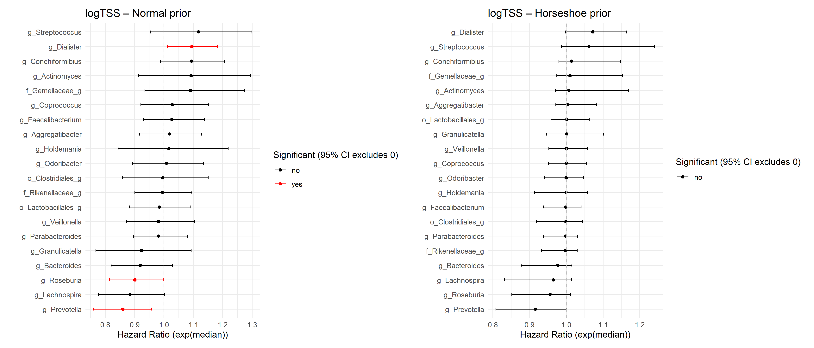
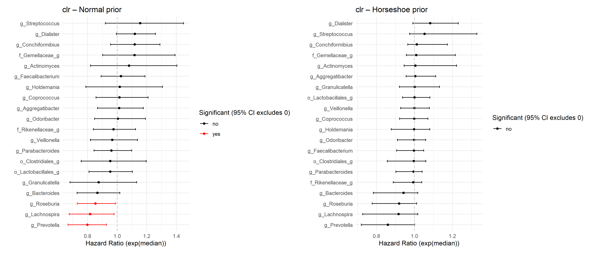
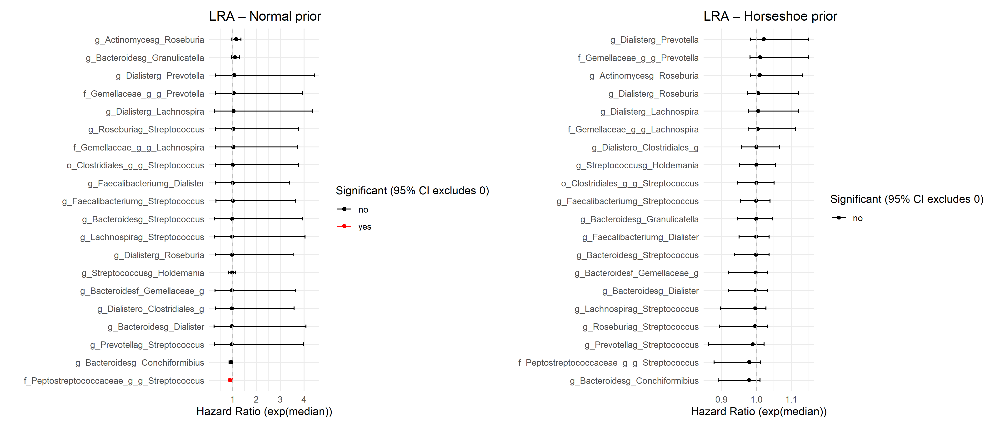
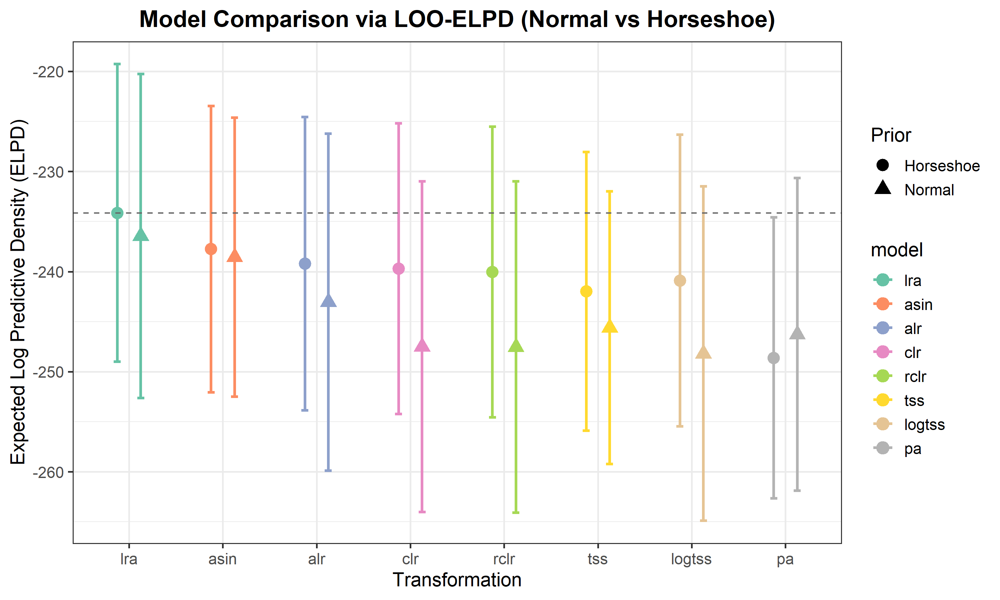

# Survivalanalysis using probabilistic models


# Introduction

Let’s download all the necessary libraries:

``` r
library(tidyverse)
library(brms)
library(tidybayes)
library(ggplot2)
library(TreeSummarizedExperiment)
library(posterior)
library(dplyr)
library(tidyr)
library(stringr)
library(survival)
library(survminer)
library(vegan)
library(mia)
library(bayesboot)
library(IDPSurvival)
library(cmdstanr)
library(patchwork)
```

## Data manipulation

All data preprocessing was carried out in a separate script (`data.R`) to ensure clarity and modularity in the analysis workflow. The script loads the raw data, applies appropriate transformations, removes invalid samples, and derives variables needed for modeling.

## Data transformations

To evaluate the effect of different data preprocessing strategies on survival model performance, several commonly used microbial feature transformations were applied:

-   **CLR (Centered Log-Ratio)**  
    Transforms counts to log-ratios relative to the geometric mean of all features. Suitable for compositional data.

-   **rCLR (Robust CLR)**  
    A robust version of CLR that downweights outliers. Helps reduce the influence of extreme values.

-   **log-TSS (Log-transformed Total Sum Scaling)**  
    Counts are converted to relative abundances and then log-transformed to stabilize variance and reduce skewness.

-   **LRA (Log-Ratio Analysis)**  
    Computes pairwise log-ratios between features after log-transformation. Emphasizes relative differences.

-   **PA (Presence/Absence)**  
    Binary encoding of whether each taxon is detected. Ignores abundance but captures occurrence.

-   **TSS (Total Sum Scaling)**  
    Normalizes counts to relative abundances by dividing each sample by its total count.

-   **Arcsin (Arcsin-sqrt transformation of TSS)**  
    Applies arcsin square-root transformation to relative abundances, useful for proportions near 0 or 1.

-   **ALR (Additive Log-Ratio)**  
    Computes log-ratios relative to a selected reference taxon. Sensitive to choice of reference.

Each transformation highlights different aspects of the microbial composition and is evaluated independently in downstream survival models.

# Optimizing Feature Count for Survival Prediction

In this analysis, we systematically evaluate how the number of input features affects the predictive performance of Bayesian survival models. Starting from a single feature and increasing the count in powers of two up to a predefined maximum, we compare model performance using the concordance index (C-index) across multiple data transformations. The models are fit using a weakly informative normal prior for the regression coefficients, which encourages regularization while allowing flexibility. This approach helps identify a potential “sweet spot” where the model achieves high performance with a minimal and interpretable feature set, before diminishing returns or overfitting may occur.

To analyze how predictive performance varies across transformations and different numbers of selected features, we reorganize the model results into a long-format data frame. This structure facilitates visualization and comparison across transformation methods and feature subset sizes. Each row represents a single model fit, annotated with the number of features used (`N`), the transformation method applied, and the number of taxa (`ntaxa`) considered in the subset.

``` r
# Reshape results into long format
res_brm_df <- purrr::imap_dfr(res_brm_result, function(method_list, ntaxa_name) {
  ntaxa_val <- as.numeric(gsub("ntaxa_", "", ntaxa_name))
  purrr::imap_dfr(method_list, function(df, method_name) {
    df %>%
      mutate(
        ntaxa = ntaxa_val,
        method = method_name
      )
  })
})

# Visualize C-index values across transformation methods and feature counts
ggplot(res_brm_df, aes(x = N, y = C_index, color = method)) +
  geom_line(linewidth = 1) +
  geom_point(size = 2) +
  facet_wrap(~ ntaxa, labeller = label_both, scales = "free_y") +
  labs(
    title = "C-index of Bayesian Cox models across transformation methods",
    x = "Number of selected features (N)",
    y = "C-index (posterior mean)",
    color = "Transformation"
  ) +
  scale_x_log10() +
  theme_minimal(base_size = 14)
```


Model performance, measured by the C-index, improves as more features are included but levels off around 20 features. After that, additional features offer no benefit. This suggests that using about 20 top features is a good balance between simplicity and performance.

# Survival model

In survival analysis, Cox models are fitted using microbial features as predictors. To reduce dimensionality and avoid overfitting, the 20 most informative features are selected for each data transformation based on univariate Cox regression. This improves model performance and interpretability.

Bayesian Cox models are then fitted using brm() with two alternative priors on the coefficients: a weakly informative normal(0, 1) prior and a sparsity-inducing horseshoe prior. The modeling is implemented in model.R, and results are loaded for analysis.

Posterior hazard ratio estimates are computed and visualized only for selected transformations: log-transformed relative abundance, centered log-ratio (CLR), and log-ratio analysis (LRA). This allows clearer comparison of interpretability and the direction of feature effects.

## Relative log-abundance modeling

The log-transformed total sum scaling (log-TSS) approach is a commonly used normalization method where relative abundances are scaled and log-transformed to stabilize variance and reduce skewness. Both normal and horseshoe priors were used when fitting the Bayesian Cox models to compare how the choice of prior affects the estimated hazard ratios. This transformation makes microbial data more suitable for downstream regression modeling.

We take summaries of the models.

``` r
# Print model summary
summary(fit_logtss_normal)
```

     Family: cox 
      Links: mu = log 
    Formula: Event_time | cens(1 - Event) ~ g_Streptococcus + g_Bacteroides + g_Roseburia + g_Dialister + g_Lachnospira + f_Gemellaceae_g + g_Faecalibacterium + g_Actinomyces + g_Granulicatella + g_Prevotella + g_Conchiformibius + f_Rikenellaceae_g + o_Clostridiales_g + o_Lactobacillales_g + g_Holdemania + g_Coprococcus + g_Parabacteroides + g_Aggregatibacter + g_Odoribacter + g_Veillonella 
       Data: df (Number of observations: 150) 
      Draws: 4 chains, each with iter = 4000; warmup = 2000; thin = 1;
             total post-warmup draws = 8000

    Regression Coefficients:
                        Estimate Est.Error l-95% CI u-95% CI Rhat Bulk_ESS Tail_ESS
    Intercept               0.75      1.25    -1.75     3.20 1.00     6723     6917
    g_Streptococcus         0.11      0.08    -0.05     0.26 1.00     5515     5645
    g_Bacteroides          -0.08      0.06    -0.20     0.03 1.00     5969     5372
    g_Roseburia            -0.10      0.05    -0.21    -0.00 1.00     7528     5920
    g_Dialister             0.09      0.04     0.01     0.17 1.00     6817     6281
    g_Lachnospira          -0.12      0.06    -0.25     0.00 1.00     7661     6078
    f_Gemellaceae_g         0.09      0.08    -0.07     0.24 1.00     5740     5809
    g_Faecalibacterium      0.03      0.05    -0.07     0.13 1.00     7221     5823
    g_Actinomyces           0.09      0.09    -0.09     0.26 1.00     6281     5856
    g_Granulicatella       -0.08      0.09    -0.26     0.09 1.00     6332     5978
    g_Prevotella           -0.15      0.06    -0.27    -0.04 1.00     6544     5434
    g_Conchiformibius       0.09      0.05    -0.01     0.19 1.00     7207     6097
    f_Rikenellaceae_g      -0.01      0.05    -0.10     0.09 1.00     6622     5700
    o_Clostridiales_g      -0.00      0.07    -0.15     0.14 1.00     6512     6162
    o_Lactobacillales_g    -0.02      0.05    -0.12     0.09 1.00     7430     6123
    g_Holdemania            0.02      0.10    -0.17     0.20 1.00     6934     5779
    g_Coprococcus           0.03      0.06    -0.08     0.14 1.00     6747     5800
    g_Parabacteroides      -0.02      0.05    -0.11     0.08 1.00     7544     5877
    g_Aggregatibacter       0.02      0.05    -0.09     0.12 1.00     6183     6232
    g_Odoribacter           0.01      0.06    -0.11     0.13 1.00     6435     6403
    g_Veillonella          -0.02      0.06    -0.14     0.10 1.00     6789     6150

    Draws were sampled using sampling(NUTS). For each parameter, Bulk_ESS
    and Tail_ESS are effective sample size measures, and Rhat is the potential
    scale reduction factor on split chains (at convergence, Rhat = 1).

``` r
summary(fit_logtss_hs)
```

     Family: cox 
      Links: mu = log 
    Formula: Event_time | cens(1 - Event) ~ g_Streptococcus + g_Bacteroides + g_Roseburia + g_Dialister + g_Lachnospira + f_Gemellaceae_g + g_Faecalibacterium + g_Actinomyces + g_Granulicatella + g_Prevotella + g_Conchiformibius + f_Rikenellaceae_g + o_Clostridiales_g + o_Lactobacillales_g + g_Holdemania + g_Coprococcus + g_Parabacteroides + g_Aggregatibacter + g_Odoribacter + g_Veillonella 
       Data: df (Number of observations: 150) 
      Draws: 4 chains, each with iter = 4000; warmup = 2000; thin = 1;
             total post-warmup draws = 8000

    Regression Coefficients:
                        Estimate Est.Error l-95% CI u-95% CI Rhat Bulk_ESS Tail_ESS
    Intercept               0.43      0.97    -1.49     2.33 1.00     5464     6868
    g_Streptococcus         0.07      0.07    -0.01     0.22 1.00     3973     5984
    g_Bacteroides          -0.04      0.04    -0.13     0.02 1.00     5082     6219
    g_Roseburia            -0.05      0.05    -0.16     0.01 1.00     4606     5750
    g_Dialister             0.07      0.04    -0.00     0.15 1.00     4069     3603
    g_Lachnospira          -0.05      0.06    -0.18     0.01 1.00     4466     6272
    f_Gemellaceae_g         0.03      0.04    -0.03     0.14 1.00     5633     7044
    g_Faecalibacterium     -0.01      0.02    -0.06     0.04 1.00     8503     7443
    g_Actinomyces           0.02      0.05    -0.03     0.16 1.00     6486     7138
    g_Granulicatella        0.01      0.03    -0.05     0.10 1.00     7465     7012
    g_Prevotella           -0.09      0.06    -0.21     0.00 1.00     4052     3004
    g_Conchiformibius       0.03      0.04    -0.02     0.14 1.00     5430     6736
    f_Rikenellaceae_g      -0.01      0.02    -0.07     0.03 1.00     8163     6952
    o_Clostridiales_g      -0.01      0.03    -0.09     0.04 1.00     7858     6770
    o_Lactobacillales_g     0.00      0.02    -0.04     0.06 1.00     8464     7292
    g_Holdemania           -0.01      0.03    -0.09     0.06 1.00     8398     7127
    g_Coprococcus          -0.00      0.02    -0.05     0.05 1.00     9176     6932
    g_Parabacteroides      -0.01      0.02    -0.06     0.03 1.00     8605     7500
    g_Aggregatibacter       0.01      0.03    -0.03     0.08 1.00     7819     7541
    g_Odoribacter          -0.00      0.02    -0.06     0.05 1.00     9881     7519
    g_Veillonella           0.00      0.02    -0.05     0.06 1.00     9246     7437

    Draws were sampled using sampling(NUTS). For each parameter, Bulk_ESS
    and Tail_ESS are effective sample size measures, and Rhat is the potential
    scale reduction factor on split chains (at convergence, Rhat = 1).

The models show good convergence diagnostics. All Rhat values are equal to 1.00, indicating that the chains have converged well. Additionally, both Bulk and Tail Effective Sample Sizes (ESS) are high across all parameters, suggesting that the posterior distributions are well estimated and the sampling was efficient.

Posterior samples of the coefficients are extracted and summarized by computing the median, 2.5%, and 97.5% quantiles, forming the 95% credible interval for each predictor. The posterior medians and credible intervals are plotted as hazard ratios. Predictors whose intervals do not cross 1 (indicating statistical relevance) are highlighted in red, and others in black. The plot is sorted by effect size.

``` r
# Plot
p1 <- plot_top_hr(fit_logtss_normal,
                  title = "logTSS – Normal prior",
                  top_k = 20)
p2 <- plot_top_hr(fit_logtss_hs,
                  title = "logTSS – Horseshoe prior",
                  top_k = 20)
p1 + p2
```



In the logTSS-transformed models, the normal prior identified several taxa with credible intervals excluding 1, including g_Dialister (higher risk) and g_Roseburia and g_Prevotella (lower risk). Under the horseshoe prior, all coefficients were shrunk toward zero and no taxa remained significant, reflecting the stronger regularization of this prior.

## CLR-transformed modeling

In another model, we used the top microbial features based on their individual associations with the outcome. Before fitting the model, we applied a centered log-ratio (CLR) transformation to express each microbe’s level in relation to the others. Both models were fitted with different priors (normal and horseshoe) to compare the effect of prior choice on coefficient estimates. This helps make the results easier to interpret and reduces the chance of misleading correlations.

We take summaries of the models.

``` r
# Print model summary
summary(fit_clr_normal)
```

     Family: cox 
      Links: mu = log 
    Formula: Event_time | cens(1 - Event) ~ g_Streptococcus + g_Bacteroides + g_Roseburia + g_Dialister + g_Lachnospira + f_Gemellaceae_g + g_Actinomyces + g_Faecalibacterium + g_Granulicatella + o_Clostridiales_g + g_Prevotella + g_Conchiformibius + f_Rikenellaceae_g + g_Coprococcus + o_Lactobacillales_g + g_Holdemania + g_Parabacteroides + g_Aggregatibacter + g_Veillonella + g_Odoribacter 
       Data: df (Number of observations: 150) 
      Draws: 4 chains, each with iter = 4000; warmup = 2000; thin = 1;
             total post-warmup draws = 8000

    Regression Coefficients:
                        Estimate Est.Error l-95% CI u-95% CI Rhat Bulk_ESS Tail_ESS
    Intercept               0.40      0.56    -0.68     1.48 1.00     9460     6581
    g_Streptococcus         0.15      0.12    -0.08     0.37 1.00     5972     5494
    g_Bacteroides          -0.14      0.09    -0.32     0.02 1.00     6766     5739
    g_Roseburia            -0.16      0.08    -0.31    -0.01 1.00     9028     5564
    g_Dialister             0.11      0.06    -0.00     0.23 1.00     7207     6354
    g_Lachnospira          -0.20      0.10    -0.39    -0.02 1.00     8945     6353
    f_Gemellaceae_g         0.11      0.11    -0.10     0.33 1.00     6561     6158
    g_Actinomyces           0.08      0.14    -0.20     0.34 1.00     7479     6049
    g_Faecalibacterium      0.03      0.07    -0.11     0.17 1.00     7553     6102
    g_Granulicatella       -0.13      0.13    -0.38     0.12 1.00     6258     6272
    o_Clostridiales_g      -0.05      0.12    -0.28     0.18 1.00     8143     6518
    g_Prevotella           -0.23      0.08    -0.40    -0.07 1.00     8294     5026
    g_Conchiformibius       0.11      0.08    -0.05     0.25 1.00     7935     5710
    f_Rikenellaceae_g      -0.03      0.07    -0.18     0.12 1.00     7419     5766
    g_Coprococcus           0.02      0.09    -0.15     0.19 1.00     8308     6423
    o_Lactobacillales_g    -0.05      0.08    -0.21     0.10 1.00     7415     6496
    g_Holdemania            0.02      0.13    -0.24     0.27 1.00     8004     6195
    g_Parabacteroides      -0.04      0.07    -0.17     0.09 1.00     8995     6302
    g_Aggregatibacter       0.01      0.08    -0.14     0.16 1.00     7439     6213
    g_Veillonella          -0.03      0.08    -0.20     0.13 1.00     9010     5735
    g_Odoribacter           0.01      0.09    -0.17     0.18 1.00     7378     5466

    Draws were sampled using sampling(NUTS). For each parameter, Bulk_ESS
    and Tail_ESS are effective sample size measures, and Rhat is the potential
    scale reduction factor on split chains (at convergence, Rhat = 1).

``` r
summary(fit_clr_hs)
```

     Family: cox 
      Links: mu = log 
    Formula: Event_time | cens(1 - Event) ~ g_Streptococcus + g_Bacteroides + g_Roseburia + g_Dialister + g_Lachnospira + f_Gemellaceae_g + g_Actinomyces + g_Faecalibacterium + g_Granulicatella + o_Clostridiales_g + g_Prevotella + g_Conchiformibius + f_Rikenellaceae_g + g_Coprococcus + o_Lactobacillales_g + g_Holdemania + g_Parabacteroides + g_Aggregatibacter + g_Veillonella + g_Odoribacter 
       Data: df (Number of observations: 150) 
      Draws: 4 chains, each with iter = 4000; warmup = 2000; thin = 1;
             total post-warmup draws = 8000

    Regression Coefficients:
                        Estimate Est.Error l-95% CI u-95% CI Rhat Bulk_ESS Tail_ESS
    Intercept               0.29      0.47    -0.62     1.18 1.00     6000     6414
    g_Streptococcus         0.08      0.09    -0.03     0.28 1.00     4693     6863
    g_Bacteroides          -0.08      0.08    -0.24     0.02 1.00     4443     6491
    g_Roseburia            -0.09      0.08    -0.25     0.01 1.00     4238     6087
    g_Dialister             0.08      0.06    -0.01     0.21 1.00     4295     5030
    g_Lachnospira          -0.10      0.10    -0.32     0.02 1.00     4113     6077
    f_Gemellaceae_g         0.03      0.06    -0.04     0.20 1.00     6874     7347
    g_Actinomyces           0.03      0.06    -0.06     0.20 1.00     7372     7337
    g_Faecalibacterium     -0.01      0.03    -0.10     0.05 1.00     7848     7143
    g_Granulicatella        0.01      0.05    -0.08     0.12 1.00     9668     6915
    o_Clostridiales_g      -0.02      0.05    -0.15     0.06 1.00     8565     6934
    g_Prevotella           -0.15      0.09    -0.33     0.00 1.00     3448     2623
    g_Conchiformibius       0.03      0.05    -0.04     0.16 1.00     5495     6778
    f_Rikenellaceae_g      -0.02      0.04    -0.12     0.04 1.00     8629     7488
    g_Coprococcus          -0.00      0.03    -0.08     0.07 1.00    10041     7165
    o_Lactobacillales_g     0.00      0.03    -0.06     0.08 1.00     8758     7614
    g_Holdemania           -0.01      0.05    -0.13     0.08 1.00     8927     7023
    g_Parabacteroides      -0.01      0.03    -0.10     0.04 1.00     8618     7485
    g_Aggregatibacter       0.01      0.04    -0.04     0.11 1.00     8081     6963
    g_Veillonella           0.00      0.03    -0.07     0.08 1.00     9783     7234
    g_Odoribacter          -0.01      0.03    -0.09     0.06 1.00     8892     8074

    Draws were sampled using sampling(NUTS). For each parameter, Bulk_ESS
    and Tail_ESS are effective sample size measures, and Rhat is the potential
    scale reduction factor on split chains (at convergence, Rhat = 1).

The models show good convergence diagnostics. All Rhat values are equal to 1.00, indicating that the chains have converged well. Additionally, both Bulk and Tail Effective Sample Sizes (ESS) are high across all parameters, suggesting that the posterior distributions are well estimated and the sampling was efficient.

The posterior medians and credible intervals are plotted as hazard ratios as earlier.

``` r
# Plot
p1 <- plot_top_hr(fit_clr_normal,
                  title = "clr – Normal prior",
                  top_k = 20)
p2 <- plot_top_hr(fit_clr_hs,
                  title = "clr – Horseshoe prior",
                  top_k = 20)
p1 + p2
```



In the CLR-transformed models, the normal prior identified g_Roseburia, g_Lachnospira, and g_Prevotella as significantly associated with lower risk. With the horseshoe prior, all effects were shrunk toward zero and no taxa remained significant, indicating stronger regularization.

## LRA-based modeling

We also built survival models using pairwise log-ratios between selected microbial taxa. Both models were fitted with different priors (normal and horseshoe) to compare the effect of prior choice on coefficient estimates. This method focuses on the balance between microbes instead of looking at their individual levels. It helps reduce misleading associations and gives a clearer picture of how microbes relate to the outcome relative to one another.

We take summaries of the models.

``` r
# Print model summary
summary(fit_lra_normal)
```

     Family: cox 
      Links: mu = log 
    Formula: Event_time | cens(1 - Event) ~ g_Lachnospirag_Streptococcus + g_Dialisterg_Roseburia + g_Prevotellag_Streptococcus + g_Roseburiag_Streptococcus + g_Dialistero_Clostridiales_g + g_Dialisterg_Lachnospira + g_Bacteroidesg_Streptococcus + o_Clostridiales_g_g_Streptococcus + f_Gemellaceae_g_g_Lachnospira + g_Bacteroidesf_Gemellaceae_g + g_Faecalibacteriumg_Streptococcus + g_Streptococcusg_Holdemania + g_Dialisterg_Prevotella + g_Bacteroidesg_Dialister + f_Gemellaceae_g_g_Prevotella + g_Faecalibacteriumg_Dialister + g_Bacteroidesg_Conchiformibius + g_Actinomycesg_Roseburia + g_Bacteroidesg_Granulicatella + f_Peptostreptococcaceae_g_g_Streptococcus 
       Data: df (Number of observations: 150) 
      Draws: 4 chains, each with iter = 4000; warmup = 2000; thin = 1;
             total post-warmup draws = 8000

    Regression Coefficients:
                                              Estimate Est.Error l-95% CI u-95% CI
    Intercept                                     0.47      0.55    -0.63     1.51
    g_Lachnospirag_Streptococcus                 -0.03      0.73    -1.46     1.40
    g_Dialisterg_Roseburia                       -0.03      0.66    -1.32     1.27
    g_Prevotellag_Streptococcus                  -0.05      0.73    -1.49     1.38
    g_Roseburiag_Streptococcus                    0.04      0.66    -1.24     1.33
    g_Dialistero_Clostridiales_g                 -0.03      0.65    -1.30     1.28
    g_Dialisterg_Lachnospira                      0.03      0.74    -1.41     1.48
    g_Bacteroidesg_Streptococcus                 -0.03      0.72    -1.45     1.37
    o_Clostridiales_g_g_Streptococcus             0.01      0.66    -1.26     1.33
    f_Gemellaceae_g_g_Lachnospira                 0.02      0.67    -1.28     1.32
    g_Bacteroidesf_Gemellaceae_g                 -0.03      0.68    -1.37     1.29
    g_Faecalibacteriumg_Streptococcus             0.01      0.64    -1.22     1.29
    g_Streptococcusg_Holdemania                  -0.03      0.08    -0.18     0.12
    g_Dialisterg_Prevotella                       0.07      0.72    -1.34     1.49
    g_Bacteroidesg_Dialister                     -0.05      0.74    -1.52     1.41
    f_Gemellaceae_g_g_Prevotella                  0.04      0.67    -1.26     1.37
    g_Faecalibacteriumg_Dialister                -0.00      0.64    -1.29     1.23
    g_Bacteroidesg_Conchiformibius               -0.08      0.04    -0.16     0.01
    g_Actinomycesg_Roseburia                      0.14      0.08    -0.03     0.30
    g_Bacteroidesg_Granulicatella                 0.09      0.08    -0.07     0.25
    f_Peptostreptococcaceae_g_g_Streptococcus    -0.11      0.05    -0.22    -0.01
                                              Rhat Bulk_ESS Tail_ESS
    Intercept                                 1.00     9937     7204
    g_Lachnospirag_Streptococcus              1.00     7657     5947
    g_Dialisterg_Roseburia                    1.00     5682     5530
    g_Prevotellag_Streptococcus               1.00     7466     5627
    g_Roseburiag_Streptococcus                1.00     5643     5726
    g_Dialistero_Clostridiales_g              1.00     5937     5701
    g_Dialisterg_Lachnospira                  1.00     7240     5895
    g_Bacteroidesg_Streptococcus              1.00     7940     6380
    o_Clostridiales_g_g_Streptococcus         1.00     5955     5614
    f_Gemellaceae_g_g_Lachnospira             1.00     7001     5923
    g_Bacteroidesf_Gemellaceae_g              1.00     6313     5799
    g_Faecalibacteriumg_Streptococcus         1.00     6600     6127
    g_Streptococcusg_Holdemania               1.00    13470     6140
    g_Dialisterg_Prevotella                   1.00     7787     5740
    g_Bacteroidesg_Dialister                  1.00     7265     6076
    f_Gemellaceae_g_g_Prevotella              1.00     6711     5626
    g_Faecalibacteriumg_Dialister             1.00     6616     5959
    g_Bacteroidesg_Conchiformibius            1.00    12099     5753
    g_Actinomycesg_Roseburia                  1.00    11075     6222
    g_Bacteroidesg_Granulicatella             1.00    12119     6144
    f_Peptostreptococcaceae_g_g_Streptococcus 1.00    14218     6183

    Draws were sampled using sampling(NUTS). For each parameter, Bulk_ESS
    and Tail_ESS are effective sample size measures, and Rhat is the potential
    scale reduction factor on split chains (at convergence, Rhat = 1).

``` r
summary(fit_lra_hs)
```

     Family: cox 
      Links: mu = log 
    Formula: Event_time | cens(1 - Event) ~ g_Lachnospirag_Streptococcus + g_Dialisterg_Roseburia + g_Prevotellag_Streptococcus + g_Roseburiag_Streptococcus + g_Dialistero_Clostridiales_g + g_Dialisterg_Lachnospira + g_Bacteroidesg_Streptococcus + o_Clostridiales_g_g_Streptococcus + f_Gemellaceae_g_g_Lachnospira + g_Bacteroidesf_Gemellaceae_g + g_Faecalibacteriumg_Streptococcus + g_Streptococcusg_Holdemania + g_Dialisterg_Prevotella + g_Bacteroidesg_Dialister + f_Gemellaceae_g_g_Prevotella + g_Faecalibacteriumg_Dialister + g_Bacteroidesg_Conchiformibius + g_Actinomycesg_Roseburia + g_Bacteroidesg_Granulicatella + f_Peptostreptococcaceae_g_g_Streptococcus 
       Data: df (Number of observations: 150) 
      Draws: 4 chains, each with iter = 4000; warmup = 2000; thin = 1;
             total post-warmup draws = 8000

    Regression Coefficients:
                                              Estimate Est.Error l-95% CI u-95% CI
    Intercept                                     0.39      0.43    -0.43     1.21
    g_Lachnospirag_Streptococcus                 -0.01      0.03    -0.11     0.03
    g_Dialisterg_Roseburia                        0.02      0.04    -0.03     0.11
    g_Prevotellag_Streptococcus                  -0.03      0.05    -0.15     0.02
    g_Roseburiag_Streptococcus                   -0.02      0.03    -0.11     0.03
    g_Dialistero_Clostridiales_g                  0.00      0.02    -0.04     0.06
    g_Dialisterg_Lachnospira                      0.02      0.03    -0.02     0.11
    g_Bacteroidesg_Streptococcus                 -0.01      0.02    -0.07     0.04
    o_Clostridiales_g_g_Streptococcus            -0.00      0.02    -0.05     0.05
    f_Gemellaceae_g_g_Lachnospira                 0.02      0.03    -0.02     0.11
    g_Bacteroidesf_Gemellaceae_g                 -0.01      0.03    -0.08     0.03
    g_Faecalibacteriumg_Streptococcus            -0.00      0.02    -0.05     0.04
    g_Streptococcusg_Holdemania                   0.00      0.02    -0.05     0.05
    g_Dialisterg_Prevotella                       0.04      0.05    -0.02     0.14
    g_Bacteroidesg_Dialister                     -0.01      0.03    -0.08     0.03
    f_Gemellaceae_g_g_Prevotella                  0.03      0.04    -0.02     0.14
    g_Faecalibacteriumg_Dialister                -0.00      0.02    -0.05     0.04
    g_Bacteroidesg_Conchiformibius               -0.03      0.04    -0.12     0.01
    g_Actinomycesg_Roseburia                      0.03      0.04    -0.02     0.12
    g_Bacteroidesg_Granulicatella                -0.00      0.02    -0.06     0.04
    f_Peptostreptococcaceae_g_g_Streptococcus    -0.03      0.04    -0.13     0.01
                                              Rhat Bulk_ESS Tail_ESS
    Intercept                                 1.00     7631     6908
    g_Lachnospirag_Streptococcus              1.00     8232     6727
    g_Dialisterg_Roseburia                    1.00     6031     6621
    g_Prevotellag_Streptococcus               1.00     4774     6955
    g_Roseburiag_Streptococcus                1.00     6523     6692
    g_Dialistero_Clostridiales_g              1.00     8660     6745
    g_Dialisterg_Lachnospira                  1.00     6320     6227
    g_Bacteroidesg_Streptococcus              1.00     8742     6133
    o_Clostridiales_g_g_Streptococcus         1.00     8759     7060
    f_Gemellaceae_g_g_Lachnospira             1.00     7029     6810
    g_Bacteroidesf_Gemellaceae_g              1.00     6866     6579
    g_Faecalibacteriumg_Streptococcus         1.00     9746     6896
    g_Streptococcusg_Holdemania               1.00     9582     7163
    g_Dialisterg_Prevotella                   1.00     3643     6638
    g_Bacteroidesg_Dialister                  1.00     7111     6129
    f_Gemellaceae_g_g_Prevotella              1.00     5016     7404
    g_Faecalibacteriumg_Dialister             1.00     9560     6366
    g_Bacteroidesg_Conchiformibius            1.00     5239     7444
    g_Actinomycesg_Roseburia                  1.00     5720     6528
    g_Bacteroidesg_Granulicatella             1.00     8649     6391
    f_Peptostreptococcaceae_g_g_Streptococcus 1.00     5452     7085

    Draws were sampled using sampling(NUTS). For each parameter, Bulk_ESS
    and Tail_ESS are effective sample size measures, and Rhat is the potential
    scale reduction factor on split chains (at convergence, Rhat = 1).

The models show good convergence diagnostics. All Rhat values are equal to 1.00, indicating that the chains have converged well. Bulk and Tail Effective Sample Sizes are also high, suggesting that the posterior distributions are well estimated and sampling was efficient.

The log-ratio coefficients are plotted below as hazard ratios.

``` r
# Plot
p1 <- plot_top_hr(fit_lra_normal,
                  title = "LRA – Normal prior",
                  top_k = 20)
p2 <- plot_top_hr(fit_lra_hs,
                  title = "LRA – Horseshoe prior",
                  top_k = 20)
p1 + p2
```



In the LRA-transformed models, the normal prior produced some wide credible intervals, likely reflecting collinearity among the log-ratio features. Only one feature (f_Peptostreptococcaceae_g_g_Streptococcus) was significant. Under the horseshoe prior, all effects were more strongly shrunk toward zero, and no features remained significant, consistent with its stronger regularization.

# Survival curves

## Kaplan-Meier curve

First classical Kaplan–Meier estimator is applied to provide a robust and interpretable nonparametric summary of cumulative mortality over time.

``` r
# Fit Kaplan-Meier survival model
surv_fit <- survfit(Surv(Event_time, Event) ~ 1, data = df)

# Plot cumulative mortality curve
ggsurvplot(
  surv_fit,
  data = df,
  conf.int = TRUE,
  fun = "event",  
  palette = "blue",
  xlab = "Time (years)",
  ylab = "Cumulative mortality (%)",
  title = "Overall cumulative mortality"
)
```


This plot shows the overall cumulative mortality over a 10-year follow-up period. The curve represents the estimated probability of death over time in the entire cohort. The shaded area around the curve indicates the 95% confidence interval, and the small vertical ticks represent censored observations. By the end of the follow-up, cumulative mortality reaches approximately 60%, with a fairly steady increase over time.

## Probabilistic Survival Curve with IDPSurvival

We now estimate a probabilistic survival curve using the `isurvfit()` function from the `IDPSurvival` package. This method is based on the Imprecise Dirichlet Process, which provides robust survival estimates with uncertainty bounds, especially useful for small or uncertain datasets.

``` r
# Create the Surv object
surv_obj <- Surv(time = df$Event_time, event = df$Event)

# Estimate the IDP survival curve
fit <- isurvfit(surv_obj ~ 1, data = df, s = 1, 
                conf.type = "exact", nsamples = 2000, display = FALSE)

# Plot the survival curve
plot(fit)
title("Probabilistic Survival Curve (IDP)")
mtext("Time (years)", side = 1, line = 2)
mtext("Survival probability", side = 2, line = 2)
legend('bottomleft', c("Lower expectation",
          "Upper expectation","Confidence intervals"), lty=c(1,1,2),lwd=c(1,2,1))
```


The parameter `s = 1` controls the strength of the prior. A higher `s` reflects more confidence in the prior and results in narrower uncertainty bands. Conversely, lower values of `s` allow for more imprecision, widening the interval between lower and upper expectations. The parameter `nsamples = 2000` specifies the number of posterior samples used to construct the credible intervals. A larger value gives a smoother and more stable estimate of the uncertainty region. The `conf.type = "exact"` option determines how the uncertainty bounds are calculated. When set to `"exact"`, the intervals are computed using the full posterior distribution.

## Comparison of Classical and Probabilistic Survival Estimation Methods

To better understand the differences between classical and probabilistic survival estimates, we compare the Kaplan–Meier curve with the survival curve derived from the Imprecise Dirichlet Process approach.

``` r
# Fit the classical Kaplan–Meier survival model
km_fit <- survfit(Surv(Event_time, Event) ~ 1, data = df)

# Fit the probabilistic IDP survival model (s = 1)
idp_fit <- isurvfit(Surv(Event_time, Event) ~ 1, data = df, s = 1,
                    conf.type = "exact", nsamples = 2000, display = FALSE)

# Prepare Kaplan–Meier survival curve data
km_df <- data.frame(
  time = km_fit$time,
  surv = km_fit$surv,
  lower = km_fit$lower,
  upper = km_fit$upper,
  method = "Kaplan–Meier"
)

# Prepare IDP survival curve data using midpoint between lower and upper expectations
idp_df <- data.frame(
  time = idp_fit$time,
  surv = (idp_fit$survUP + idp_fit$survLOW) / 2,
  lower = idp_fit$lower,
  upper = idp_fit$upper,
  method = "IDP (s = 1)"
)

# Combine the datasets for plotting
combined_df <- bind_rows(km_df, idp_df)

# Plot the survival curves
ggplot(combined_df, aes(x = time, y = surv, color = method, fill = method)) +
  geom_step(linewidth = 1.2) +
  geom_ribbon(aes(ymin = lower, ymax = upper), alpha = 0.2, color = NA) +
  labs(
    title = "Survival Curve Comparison: Kaplan–Meier vs. IDP (s = 1)",
    x = "Time",
    y = "Survival probability",
    color = "Method",
    fill = "Method"
  ) +
  theme_minimal(base_size = 14)
```


The point estimates from the IDP and Kaplan–Meier methods are very similar, but the uncertainty band from the IDP model lies slightly lower than uncertainty band from the Kaplan-Meier.

# Comparison of transformations Using Microbial Features in Survival Analysis

To evaluate how different data transformations affect survival modeling, we compared eight preprocessing approaches:
centered log-ratio (CLR), robust CLR (rCLR), pairwise log-ratio analysis (LRA), additive log-ratio (ALR), presence/absence (PA), total sum scaling (TSS), log-transformed TSS (logTSS), and arcsin square root (ASIN).

For each transformation, we selected the 20 microbial features most strongly associated with survival time based on univariate Cox regression. This consistent feature selection ensures a fair comparison across transformations.

Bayesian Cox proportional hazards models were fitted for each transformation using two different priors on the coefficients:

-   Normal(0,1) prior, representing weakly informative assumptions.

-   Horseshoe prior, promoting sparsity and reducing overfitting in high-dimensional settings.

Model performance for each prior–transformation combination was evaluated using leave-one-out cross-validation (LOO) to estimate out-of-sample predictive accuracy.

``` r
# Check Pareto k diagnostics
cat("Normal prior models – Pareto k > 0.7:\n")
```

    Normal prior models – Pareto k > 0.7:

``` r
print(sapply(loo_normal, function(x) sum(x$diagnostics$pareto_k > 0.7)))
```

       clr   rclr logtss    lra     pa    tss   asin    alr 
         0      0      0      0      0      0      0      0 

``` r
cat("\nHorseshoe prior models – Pareto k > 0.7:\n")
```


    Horseshoe prior models – Pareto k > 0.7:

``` r
print(sapply(loo_hs, function(x) sum(x$diagnostics$pareto_k > 0.7)))
```

       clr   rclr logtss    lra     pa    tss   asin    alr 
         0      0      0      0      0      0      0      0 

``` r
# Print LOO comparisons
cat("\nLOO comparison – Normal prior:\n")
```


    LOO comparison – Normal prior:

``` r
print(loo_comp_normal)
```

                  elpd_diff se_diff
    lra_normal      0.0       0.0  
    asin_normal    -1.9       5.5  
    alr_normal     -7.0       2.2  
    tss_normal     -9.2       6.4  
    clr_normal    -11.0       2.9  
    rclr_normal   -11.2       3.0  
    logtss_normal -11.3       2.4  
    pa_normal     -19.8       7.3  

``` r
cat("\nLOO comparison – Horseshoe prior:\n")
```


    LOO comparison – Horseshoe prior:

``` r
print(loo_comp_hs)
```

              elpd_diff se_diff
    lra_hs      0.0       0.0  
    asin_hs    -3.9       2.8  
    alr_hs     -5.2       1.2  
    clr_hs     -5.7       1.6  
    rclr_hs    -5.8       1.5  
    logtss_hs  -6.8       1.3  
    tss_hs     -8.0       3.9  
    pa_hs     -22.3       5.3  

``` r
# Create combined data frame
dff_all <- rbind(
  get_elpd_df(loo_normal, "Normal"),
  get_elpd_df(loo_hs, "Horseshoe")
)

# Keep model order consistent by average performance
model_order <- dff_all %>%
  group_by(model) %>%
  summarise(mean_elpd = mean(elpd, na.rm = TRUE)) %>%
  arrange(desc(mean_elpd)) %>%
  pull(model)

dff_all$model <- factor(dff_all$model, levels = model_order)

# Plot: transformation color, prior shape
ggplot(dff_all, aes(x = model, y = elpd, color = model, shape = prior)) +
  geom_point(size = 4, position = position_dodge(width = 0.5)) +
  geom_errorbar(
    aes(ymin = elpd - se, ymax = elpd + se),
    width = 0.15,
    size = 1,
    position = position_dodge(width = 0.5)
  ) +
  geom_hline(yintercept = max(dff_all$elpd), linetype = "dashed", color = "gray40") +
  scale_color_brewer(palette = "Set2") +
  labs(
    title = "Model Comparison via LOO-ELPD (Normal vs Horseshoe)",
    y = "Expected Log Predictive Density (ELPD)",
    x = "Transformation",
    shape = "Prior"
  ) +
  theme_bw(base_size = 14) +
  theme(
    plot.title = element_text(hjust = 0.5, face = "bold")
  )
```



After applying moment matching, all Pareto $k$ values were below the recommended threshold of $0.7$, indicating that the LOO estimates are reliable for model comparison.

Across both prior specifications, the LRA (log-ratio analysis) model achieved the highest expected log predictive density (ELPD), showing the best out-of-sample predictive performance. Under the normal prior, performance differences between transformations were more pronounced, with CLR, rCLR, logTSS, and especially PA performing notably worse than LRA. With the horseshoe prior, differences between models narrowed, but LRA remained the top performer and PA consistently ranked lowest.

This pattern suggests that the stronger regularization of the horseshoe prior reduces performance gaps between transformations but does not change their ranking. The persistently poor performance of the PA model is due to the near absence of zeros in the dataset, making presence/absence encoding less informative. Overall, these results reinforce that log-ratio-based transformations, particularly LRA, yield more predictive survival models in this context.

# Model Predictions vs. Known Events

We plot the predicted risk scores from all transformations under the normal prior to examine how well each model distinguishes between events and non-events, and whether higher predicted risk corresponds to shorter observed survival times.

``` r
# Normal prior
df_rclr_n   <- get_pred_df(fit_rclr_normal,   method_name = "rCLR")
df_clr_n    <- get_pred_df(fit_clr_normal,    method_name = "CLR")
df_logtss_n <- get_pred_df(fit_logtss_normal, method_name = "logTSS")
df_lra_n    <- get_pred_df(fit_lra_normal,    method_name = "LRA")
df_pa_n     <- get_pred_df(fit_pa_normal,     method_name = "PA")
df_tss_n    <- get_pred_df(fit_tss_normal,    method_name = "TSS")
df_asin_n   <- get_pred_df(fit_asin_normal,   method_name = "Arcsin sqrt(TSS)")
df_alr_n    <- get_pred_df(fit_alr_normal,    method_name = "ALR")

df_all_n <- dplyr::bind_rows(
  df_clr_n, df_rclr_n, df_logtss_n, df_lra_n, df_pa_n, df_tss_n, df_asin_n, df_alr_n
)

ggplot(df_all_n, aes(x = risk_score, y = Event_time, color = factor(Event))) +
  geom_point(alpha = 0.7, size = 2) +
  geom_smooth(method = "loess", se = FALSE, color = "black", span = 1) +
  scale_color_manual(values = c("0" = "#00BFC4", "1" = "#F8766D")) +
  facet_wrap(~Method, scales = "free_x") +
  labs(
    title = "Predicted Risk Score vs. Survival Time (All Transformations) – Normal prior",
    x = "Predicted Risk Score (Posterior Median)",
    y = "Observed Survival Time",
    color = "Event"
  ) +
  theme_minimal(base_size = 14)
```


The plot shows a consistent negative association between predicted risk score and survival time across most transformations. Higher risk scores are linked to shorter survival, with event cases (red) clustering toward high-risk, high-survival regions and censored cases (blue) concentrated at lower risk scores and longer survival times. The fitted trend lines reinforce this relationship, suggesting that the models capture meaningful patterns in outcome timing.

Next, we repeat the visualization for models fitted with the horseshoe prior.

``` r
# Horseshoe prior
df_rclr_h   <- get_pred_df(fit_rclr_hs,   method_name = "rCLR")
df_clr_h    <- get_pred_df(fit_clr_hs,    method_name = "CLR")
df_logtss_h <- get_pred_df(fit_logtss_hs, method_name = "logTSS")
df_lra_h    <- get_pred_df(fit_lra_hs,    method_name = "LRA")
df_pa_h     <- get_pred_df(fit_pa_hs,     method_name = "PA")
df_tss_h    <- get_pred_df(fit_tss_hs,    method_name = "TSS")
df_asin_h   <- get_pred_df(fit_asin_hs,   method_name = "Arcsin sqrt(TSS)")
df_alr_h    <- get_pred_df(fit_alr_hs,    method_name = "ALR")

df_all_h <- dplyr::bind_rows(
  df_clr_h, df_rclr_h, df_logtss_h, df_lra_h, df_pa_h, df_tss_h, df_asin_h, df_alr_h
)

ggplot(df_all_h, aes(x = risk_score, y = Event_time, color = factor(Event))) +
  geom_point(alpha = 0.7, size = 2) +
  geom_smooth(method = "loess", se = FALSE, color = "black", span = 1) +
  scale_color_manual(values = c("0" = "#00BFC4", "1" = "#F8766D")) +
  facet_wrap(~Method, scales = "free_x") +
  labs(
    title = "Predicted Risk Score vs. Survival Time (All Transformations) – Horseshoe prior",
    x = "Predicted Risk Score (Posterior Median)",
    y = "Observed Survival Time",
    color = "Event"
  ) +
  theme_minimal(base_size = 14)
```


The overall patterns are visually very similar to those observed with the normal prior, indicating that the choice of prior has little effect on the qualitative relationship between predicted risk and survival time in this dataset.

# Comparing Más-o-menos scoring with the LRA model

To explore alternative strategies for risk prediction, we implemented the [Más-o-menos method](https://academic.oup.com/bioinformatics/article/30/21/3062/2422201) (Armañanzas et al., 2014), a simple sign-based approach that averages the direction of effect from univariate Cox models. Each feature contributes either positively or negatively based on the sign of its estimated coefficient, and the overall risk score is calculated as the mean of these directional contributions.

We compared this score against the log-ratio-based (LRA) Cox models (normal and horseshoe), which had previously shown the best predictive performance among the tested transformations. Both methods were evaluated on the same set of top-ranked microbial features, and their predicted risk scores were compared in relation to observed event outcomes.

``` r
# LRA, normal prior
pred_normal <- posterior_linpred(fit_lra_normal, transform = FALSE)
df_lra_normal <- df_lra
df_lra_normal$risk_score <- apply(pred_normal, 2, median)
df_lra_normal$method <- "LRA – Normal"

# LRA, horseshoe prior
pred_hs <- posterior_linpred(fit_lra_hs, transform = FALSE)
df_lra_hs <- df_lra
df_lra_hs$risk_score <- apply(pred_hs, 2, median)
df_lra_hs$method <- "LRA – Horseshoe"

# Más-o-menos
df_masomenos <- df_lra
df_masomenos$risk_score <- calculate_masomenos(df_masomenos)
df_masomenos$method <- "Más-o-menos"

df_all <- rbind(
  df_lra_normal[, c("risk_score", "Event", "method")],
  df_lra_hs[, c("risk_score", "Event", "method")],
  df_masomenos[, c("risk_score", "Event", "method")]
)

ggplot(df_all, aes(x = factor(Event), y = risk_score, fill = method)) +
  geom_boxplot(position = position_dodge(width = 0.75)) +
  scale_fill_manual(values = c(
    "LRA – Normal"    = "#1f78b4",
    "LRA – Horseshoe" = "#33a02c",
    "Más-o-menos"     = "#e31a1c"
  )) +
  labs(
    title = "Predicted Risk Scores by Event Status",
    x = "Event (0 = censored, 1 = occurred)",
    y = "Risk Score",
    fill = "Method"
  ) +
  theme_minimal(base_size = 14)
```


The figure indicates that all three methods produce higher predicted risk scores for individuals who experienced the event compared to those who were censored, showing that they capture the expected risk–outcome relationship reasonably well. The separation between groups is visible for each method, but given the degree of overlap in score distributions, no firm conclusions can be drawn about differences in performance between the methods based on this plot alone.
